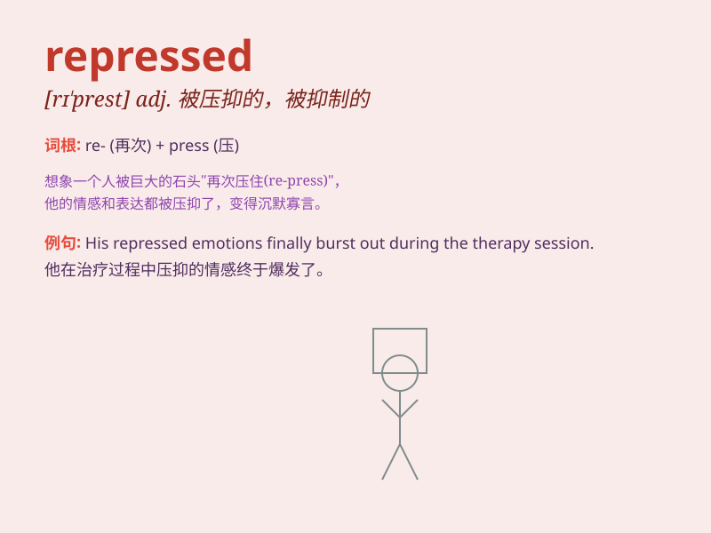

## repressed

**英音:** _[rɪ\'prest]_ **美音:** _[rɪ\'prɛst]_

**译义:** *adj.被抑制的,被压抑的*

### 短语

+ **repressed emotion:** _被压抑的情感_

+ **repressed memory:** _被压抑的记忆_

+ **repressed desire:** _被压抑的欲望_

+ **repressed personality:** _被压抑的个性_

+ **repressed anger:** _被压抑的愤怒_

### 例句

#### 例句1

> **She repressed her emotions and tried to remain calm.**

**中文翻译:** 她压抑着自己的情绪并努力保持冷静。

**单词释义:** 压抑；抑制

#### 例句2

> **The memories of that trauma were repressed for many years.**

**中文翻译:** 那段创伤的记忆被压抑了很多年。

**单词释义:** 抑制；压制

#### 例句3

> **His creativity was repressed by the strict rules of the
institution.**

**中文翻译:** 他的创造力被该机构的严格规定所压制。

**单词释义:** 压制；约束

### 背诵小故事

> A young artist felt repressed in a strict school. All her creative
ideas were suppressed. But she didn\'t give up and finally broke free,
expressing herself fully.

**一位年轻的艺术家在一所严格的学校里感到压抑。她所有的创意想法都被压制。但她没有放弃，最终挣脱束缚，充分地展现了自己。**

### 图义

