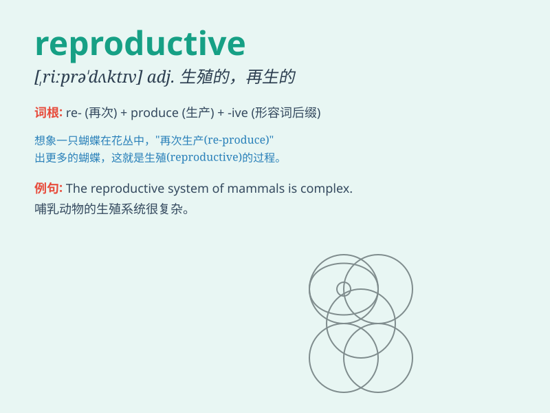

## reproductive

**英音:** _[,riːprə\'dʌktɪv]_ **美音:**
_[,riprə\'dʌktɪv]_

**译义:** *adj.生殖的,再生的,复制的*

### 短语

+ **reproductive system:** _生殖系统_

+ **reproductive organs:** _生殖器官_

+ **reproductive behavior:** _生殖行为_

+ **reproductive cycle:** _生殖周期_

+ **reproductive capacity:** _生殖能力_

### 例句

#### 例句1

> **The reproductive system of humans is complex.**

**中文翻译:** 人类的生殖系统很复杂。

**单词释义:** 生殖的

#### 例句2

> **Reproductive behavior varies among different species.**

**中文翻译:** 不同物种的繁殖行为各不相同。

**单词释义:** 繁殖的

#### 例句3

> **This plant has unique reproductive organs.**

**中文翻译:** 这种植物有独特的生殖器官。

**单词释义:** 生殖的

### 背诵小故事

> A scientist was studying a special flower. The flower\'s reproductive
process was amazing. It made many seeds to create new flowers. This
showed how reproductive works to keep life going.

**一位科学家正在研究一种特殊的花。这种花的生殖过程令人惊叹。它产生了许多种子来创造新的花。这展示了"reproductive（生殖的；繁殖的）"是如何维持生命延续的。**

### 图义

