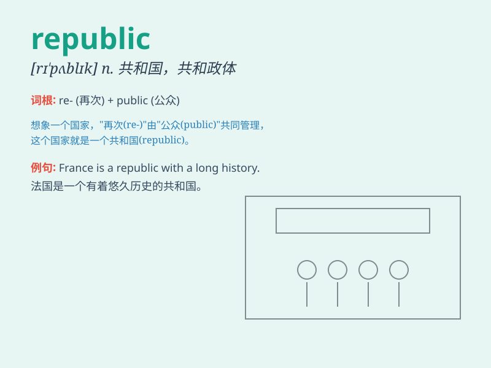

## republic

**英音:** _[rɪ\'pʌblɪk]_ **美音:** _[rɪ\'pʌblɪk]_

**译义:** *n.共和国,共和政体adj.共和的*

### 短语

+ **republic of letters:** _文学界；文坛_

+ **banana republic:**
_香蕉共和国（指经济单一、政治不稳定的中美洲或加勒比海小国）_

+ **constitutional republic:** _立宪共和国_

+ **Islamic Republic:** _伊斯兰共和国_

+ **People\'s Republic:** _人民共和国_

### 例句

#### 例句1

> **The Republic of China was established in 1912.**

**中文翻译:** 中华民国成立于 1912 年。

**单词释义:** 共和国

#### 例句2

> **The small island nation is a republic.**

**中文翻译:** 这个小岛国是一个共和国。

**单词释义:** 共和国

#### 例句3

> **He wrote a book about the republics of ancient Greece.**

**中文翻译:** 他写了一本关于古希腊共和国的书。

**单词释义:** 共和国

### 背诵小故事

> In a distant land, people decided to overthrow the monarchy. They
formed a new system where everyone had a say. This place was called a
republic, a land of equality and people\'s rule.

**在一片遥远的土地上，人们决定推翻君主制。他们建立了一个新的制度，每个人都有发言权。这个地方被称为共和国，一个平等和人民做主的地方。**

### 图义

