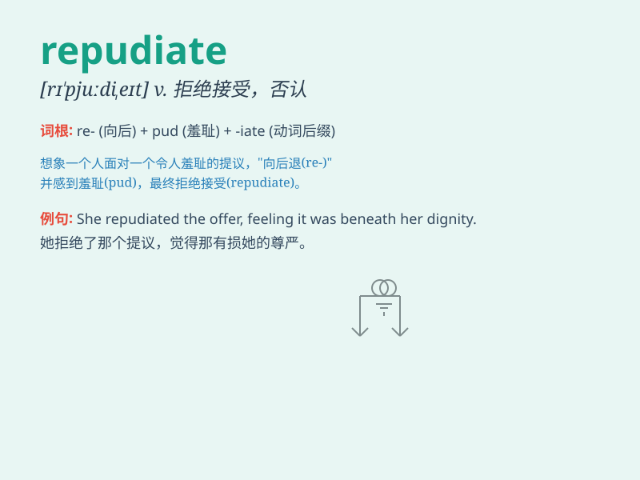

## repudiate

**英音:** _[rɪ\'pjuːdɪeɪt]_ **美音:** _[rɪ\'pjudɪet]_

**译义:** *v.批判*

### 短语

+ **repudiate a debt:** _拒绝偿还债务_

+ **repudiate a claim:** _拒绝一项要求_

+ **repudiate an idea:** _摒弃一种想法_

+ **repudiate a theory:** _否定一种理论_

+ **repudiate a contract:** _废除一份合同_

### 例句

#### 例句1

> **He repudiated the accusations against him.**

**中文翻译:** 他驳斥了对他的指控。

**单词释义:** 驳斥；否认

#### 例句2

> **The company repudiated the contract.**

**中文翻译:** 该公司拒绝履行合同。

**单词释义:** 拒绝；不承担

#### 例句3

> **She repudiated her former beliefs.**

**中文翻译:** 她抛弃了以前的信仰。

**单词释义:** 抛弃；摒弃

### 背诵小故事

> A king was accused of many wrongdoings. But he repudiated all the
accusations firmly, saying they were baseless. He refused to accept them
and defended his reputation.

**一位国王被指控多项罪行。但他坚决地否定了所有指控，称其毫无根据。他拒绝接受并捍卫了自己的声誉。**

### 图义

