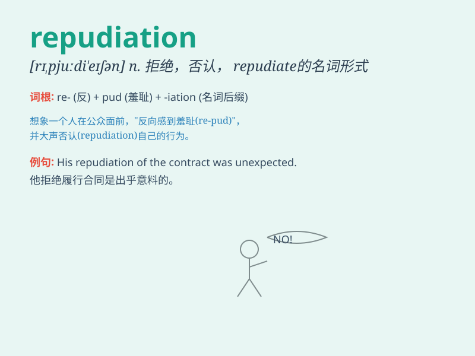

## repudiation

**英音:** _[rɪ,pjuːdɪ\'eɪʃn]_ **美音:**
_[rɪ,pjʊdɪ\'eʃən]_

**译义:** *n.批判*

### 短语

+ **repudiation of debt:** _拒绝偿债_

+ **repudiation of contract:** _拒绝履行合同_

+ **repudiation of responsibility:** _推卸责任_

+ **repudiation of claim:** _拒绝索赔_

+ **repudiation of theory:** _否定理论_

### 例句

#### 例句1

> **His repudiation of the contract led to legal consequences.**

**中文翻译:** 他对合同的拒绝导致了法律后果。

**单词释义:** 拒绝，否认

#### 例句2

> **The repudiation of traditional values by the younger generation
has raised concerns.**

**中文翻译:** 年轻一代对传统价值观的摒弃引起了关注。

**单词释义:** 摒弃，抛弃

#### 例句3

> **The politician faced public repudiation for his corrupt
practices.**

**中文翻译:** 这位政客因其腐败行为面临公众的谴责。

**单词释义:** 谴责，批判

### 背诵小故事

> A king was known for his fairness. But one day, he made a decision
that caused chaos. The people\'s response was repudiation. They refused
to accept it and demanded a change. The king learned his lesson.

**一位国王向来以公正著称。但有一天，他做了一个导致混乱的决定。民众的反应是拒绝和否认。他们拒绝接受并要求改变。国王吸取了教训。**

### 图义

