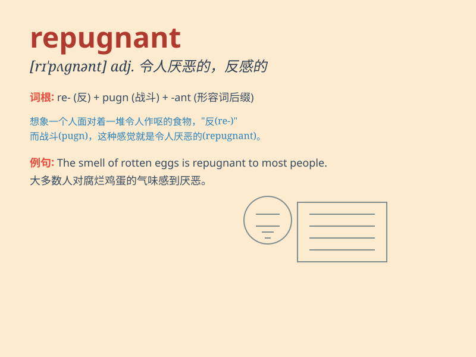

## repugnant

**英音:** _[rɪ\'pʌgnənt]_ **美音:** _[rɪ\'pʌɡnənt]_

**译义:** *adj.不一致的*

### 短语

+ **be repugnant to:** _令\...厌恶；与\...不一致_

+ **find something repugnant:** _发现某物令人厌恶_

+ **repugnant smell:** _令人厌恶的气味_

+ **repugnant behavior:** _令人反感的行为_

+ **utterly repugnant:** _极其令人厌恶_

### 例句

#### 例句1

> **The idea of cheating is repugnant to him.**

**中文翻译:** 作弊的想法令他反感。

**单词释义:** 令人反感的

#### 例句2

> **The smell of the rotten food was repugnant.**

**中文翻译:** 腐烂食物的气味令人厌恶。

**单词释义:** 令人厌恶的

#### 例句3

> **Her behavior was repugnant to all decent people.**

**中文翻译:** 她的行为让所有正派人都感到厌恶。

**单词释义:** 令人厌恶的

### 背诵小故事

> A man was invited to a dinner. But the food was repugnant. It smelled
bad and looked unappetizing. He couldn\'t stand it and left. Remember,
repugnant means causing a feeling of strong dislike or disgust.

**一个男人被邀请去参加晚宴。但食物令人厌恶。闻起来很糟糕，看起来也毫无食欲。他无法忍受然后离开了。记住，repugnant
意思是引起强烈的不喜欢或厌恶。**

### 图义

