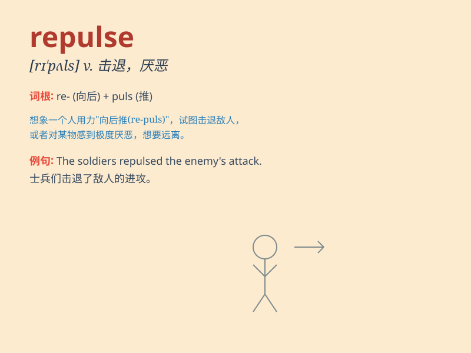

## repulse

**英音:** _[rɪ\'pʌls]_ **美音:** _[rɪ\'pʌls]_

**译义:** *v.拒绝,排斥,反驳,击退,憎恶n.拒斥,击退,严拒*

### 短语

+ **repulse an attack:** _击退攻击_

+ **repulse the invaders:** _击退侵略者_

+ **repulse someone\'s advances:** _拒绝某人的求爱_

+ **repulse with horror:** _惊恐地拒绝_

+ **meet with repulse:** _遭遇拒绝_

### 例句

#### 例句1

> **The monster\'s appearance repulsed everyone.**

**中文翻译:** 怪物的样子让所有人都感到厌恶。

**单词释义:** 使厌恶

#### 例句2

> **She repulsed his advances firmly.**

**中文翻译:** 她坚决地拒绝了他的追求。

**单词释义:** 拒绝；击退

#### 例句3

> **The army managed to repulse the enemy\'s attack.**

**中文翻译:** 军队成功击退了敌人的进攻。

**单词释义:** 击退；打退

### 背诵小故事

> A brave knight tried to enter a mysterious castle, but the powerful
guards repulsed him. The knight\'s attempts were all in vain as he was
forcefully pushed back. Remember, repulse means to reject or drive back
forcefully.

**一位勇敢的骑士试图进入一座神秘的城堡，但强大的守卫击退了他。骑士的所有尝试都徒劳无功，因为他被强行推回。记住，repulse
意思是拒绝或强行击退。**

### 图义

