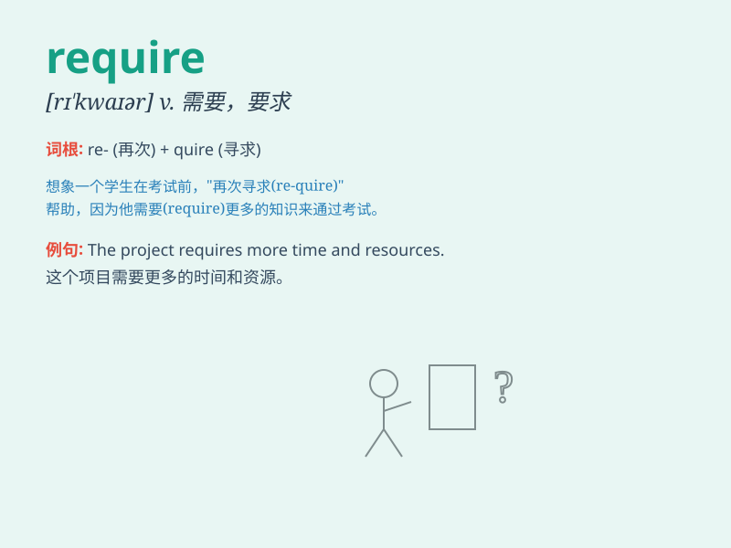

## require

**英音:** _[rɪ\'kwaɪə]_ **美音:** _[rɪ\'kwaɪr]_

**译义:** *vt.需要,要求,命令*

### 短语

+ **require doing:** _需要被做_

+ **require to do:** _需要去做_

+ **require sb. to do sth.:** _要求某人做某事_

+ **be required for:** _对\...\...是必需的_

+ **require sth. of sb.:** _向某人要求某物_

### 例句

#### 例句1

> **The job requires a lot of experience.**

**中文翻译:** 这份工作需要很多经验。

**单词释义:** 需要

#### 例句2

> **You are required to attend the meeting.**

**中文翻译:** 你被要求参加会议。

**单词释义:** 要求

#### 例句3

> **This rule requires immediate attention.**

**中文翻译:** 这条规则需要立即关注。

**单词释义:** 需要

### 背诵小故事

> A king required his subjects to bring him precious jewels. If they
failed, they would be punished. So, \'require\' means to demand
something necessary or compulsory.

**一位国王要求他的臣民给他带来珍贵的珠宝。如果他们做不到，就会受到惩罚。所以，\'require\'意思是要求某物是必要的或强制的。**

### 图义

