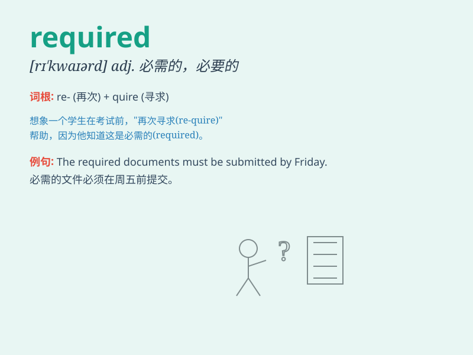

## required

**英音:** _[rɪ\'kwaɪəd]_ **美音:** _[rɪ\'kwaɪrd]_

**译义:** *adj.必需的*

### 短语

+ **be required to:** _被要求做_

+ **required course:** _必修课_

+ **required reading:** _必读材料_

+ **required standard:** _要求的标准_

+ **required skill:** _必备技能_

### 例句

#### 例句1

> **All passengers are required to show their passports.**

**中文翻译:** 所有乘客都被要求出示他们的护照。

**单词释义:** 被要求

#### 例句2

> **The course required a lot of reading and writing.**

**中文翻译:** 这门课程需要大量的阅读和写作。

**单词释义:** 需要

#### 例句3

> **A valid ID is required for entry.**

**中文翻译:** 进入需要有效的身份证件。

**单词释义:** 需要

### 背诵小故事

> A brave adventurer was on a quest. To enter the secret cave, a magic
key was required. Without it, the door would remain closed. Finally, he
found the key and fulfilled the required condition to enter.

**一位勇敢的冒险家在探险。要进入神秘洞穴，需要一把魔法钥匙。没有它，门就会一直关闭。最后，他找到了钥匙，满足了所需的条件得以进入。**

### 图义

