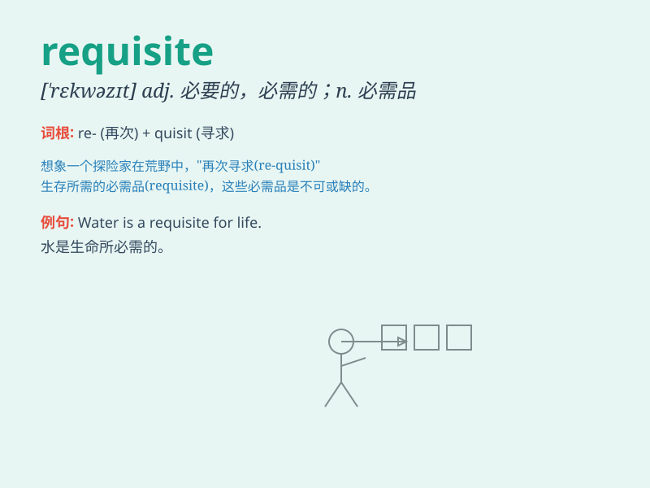

## requisite

**英音:** _[\'rekwɪzɪt]_ **美音:** _[\'rɛkwəzɪt]_

**译义:** *adj.需要的,必不可少的,必备的n.必需品*

### 短语

+ **requisite skills:** _必备技能_

+ **requisite conditions:** _必要条件_

+ **requisite knowledge:** _必要知识_

+ **requisite resources:** _必要资源_

+ **requisite equipment:** _必需设备_

### 例句

#### 例句1

> **A good knowledge of history is a requisite for understanding the
present.**

**中文翻译:** 良好的历史知识是理解当下的必要条件。

**单词释义:** 必要条件；必需品

#### 例句2

> **The requisite skills for this job include excellent communication
and problem-solving abilities.**

**中文翻译:** 这份工作所需的技能包括出色的沟通和解决问题的能力。

**单词释义:** 必要的；需要的

#### 例句3

> **She fulfilled all the requisite formalities to obtain the
visa.**

**中文翻译:** 她完成了获得签证的所有必要手续。

**单词释义:** 必要的事物；必要手续

### 背诵小故事

> A brave knight was on a quest. To enter the magical castle, he needed
a requisite key. Without it, his dream of finding the treasure inside
would be lost. Finally, he found the key and fulfilled the requisite to
enter.

**一位勇敢的骑士在进行探索。要进入那座神奇的城堡，他需要一把必备的钥匙。没有它，他在城堡内寻找宝藏的梦想就会破灭。最终，他找到了钥匙，满足了进入的必要条件。**

### 图义

