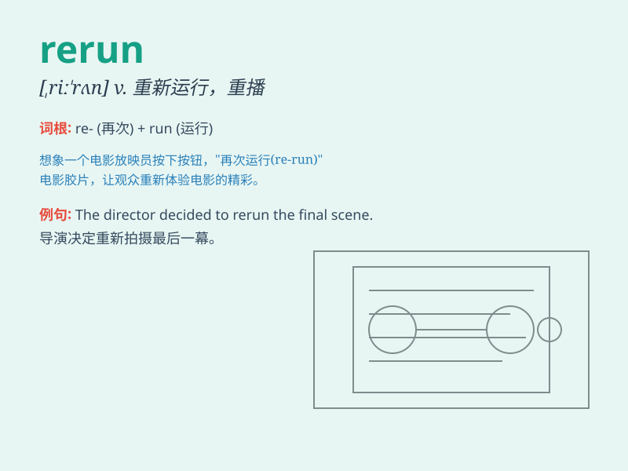

## rerun

**英音:** _[riː\'rʌn]_ **美音:** _[\'ri,rʌn]_

**译义:** *v.再运行*

### 短语

+ **rerun a program:** _重新运行一个程序_

+ **rerun an experiment:** _重新进行实验_

+ **rerun a race:** _重新赛跑_

+ **rerun a movie:** _重新放映一部电影_

+ **rerun a test:** _重新测试_

### 例句

#### 例句1

> **They decided to rerun the experiment to get more accurate
results.**

**中文翻译:** 他们决定重新进行实验以获得更准确的结果。

**单词释义:** 重新进行

#### 例句2

> **The TV station will rerun the popular drama series next
month.**

**中文翻译:** 电视台下个月将重新播放这部受欢迎的电视剧。

**单词释义:** 重新播放

#### 例句3

> **We need to rerun the calculations as there was an error.**

**中文翻译:** 由于有错误，我们需要重新计算。

**单词释义:** 重新计算

### 背诵小故事

>
想象一下，电视台准备重新播放一部超受欢迎的电视剧。工作人员忙碌地准备着，这就是\'rerun\'，再次播放的意思。就像我们的回忆，有时也会rerun，在脑海中再次浮现。

**想象电视台重新播放电视剧来辅助理解 rerun 意为再次播放、重新运行**

### 图义

