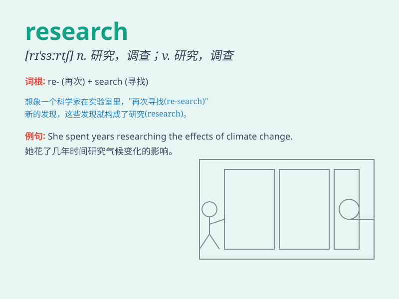

## research

**英音:** _[rɪ\'sɜːtʃ; \'riːsɜːtʃ]_ **美音:**
_[\'risɝtʃ]_

**译义:** *n.研究,调查vi.研究,调查*

### 短语

+ **research into:** _探究；调查_

+ **research work:** _研究工作_

+ **scientific research:** _科学研究_

+ **research project:** _研究项目_

+ **market research:** _市场调查_

### 例句

#### 例句1

> **The scientist is conducting research on climate change.**

**中文翻译:** 这位科学家正在进行关于气候变化的研究。

**单词释义:** 研究；调查

#### 例句2

> **We need to do more research before making a decision.**

**中文翻译:** 在做决定之前我们需要做更多的研究。

**单词释义:** 研究；探究

#### 例句3

> **The research shows that exercise is beneficial to health.**

**中文翻译:** 这项研究表明锻炼对健康有益。

**单词释义:** 研究；调查

### 背诵小故事

> A scientist was on a long journey of research. He spent days and
nights in the lab, looking for answers. Through hard work and countless
experiments, he finally made a great discovery.

**一位科学家正在进行漫长的研究之旅。他在实验室里日夜钻研，寻找答案。通过努力工作和无数次实验，他终于有了重大发现。**

### 图义

