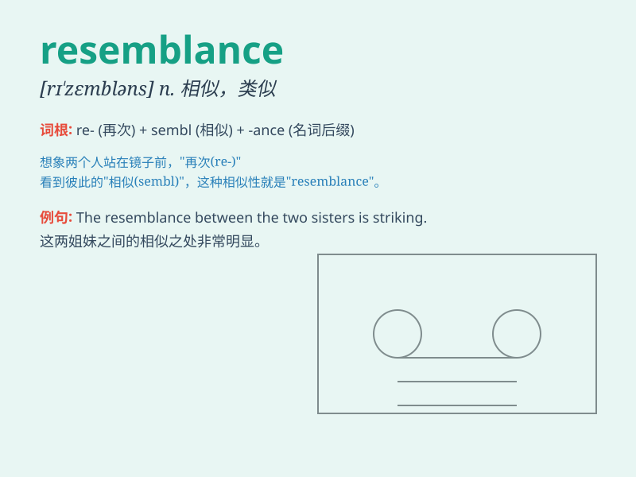

## resemblance

**英音:** _[rɪ\'zembl(ə)ns]_ **美音:** _[rɪ\'zɛmbləns]_

**译义:** *n.类同之处*

### 短语

+ **bear a resemblance to:** _与\...\...相似_

+ **close resemblance:** _非常相似_

+ **striking resemblance:** _惊人的相似_

+ **vague resemblance:** _模糊的相似_

+ **family resemblance:** _家族相似性_

### 例句

#### 例句1

> **There is a resemblance between the two sisters.**

**中文翻译:** 这两姐妹有相似之处。

**单词释义:** 相似；相像

#### 例句2

> **The new building bears a resemblance to the old one.**

**中文翻译:** 这座新建筑和那座旧建筑相似。

**单词释义:** 相似；类似

#### 例句3

> **I see no resemblance between him and his brother.**

**中文翻译:** 我看不出他和他兄弟之间有什么相似之处。

**单词释义:** 相似之处；类似之处

### 背诵小故事

> A prince was looking for his long-lost sister. One day, he met a girl
who had a resemblance to his mother. Later, he discovered she was indeed
his sister. The similarity in their features led to the reunion.

**一位王子正在寻找他失散已久的妹妹。有一天，他遇到一个女孩，她和他的母亲有相似之处。后来，他发现她确实是他的妹妹。他们外貌的相似性促成了这次团聚。**

### 图义

