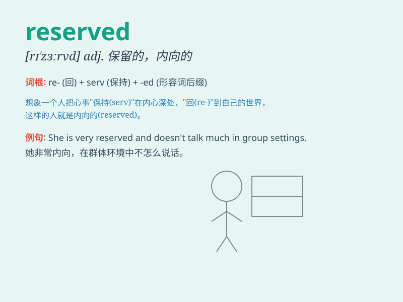

## reserved

**英音:** _[rɪ\'zɜːvd]_ **美音:** _[rɪ\'zɝvd]_

**译义:** *adj.保留的,包租的*

### 短语

+ **reserved seat:** _预订座位_

+ **reserved parking:** _预留停车位_

+ **reserved character:** _保留字符_

+ **reserved power:** _保留权力_

+ **reserved list:** _保留名单_

### 例句

#### 例句1

> **He is a reserved person and doesn\'t talk much in public.**

**中文翻译:** 他是一个内向的人，在公共场合话不多。

**单词释义:** 内向的；寡言少语的

#### 例句2

> **The best seats in the theater are reserved for special
guests.**

**中文翻译:** 剧院里最好的座位是为特别来宾预留的。

**单词释义:** 预留；保留

#### 例句3

> **She has a reserved manner that makes her seem unapproachable.**

**中文翻译:** 她举止矜持，让人觉得难以接近。

**单词释义:** 矜持的；拘谨的

### 背诵小故事

> A reserved person named Lily always kept her thoughts to herself. She
never spoke much in public and preferred to stay in a quiet corner. But
when a friend needed help, she showed her true kindness. \'Reserved\'
means being quiet and keeping your feelings hidden.

**一个叫莉莉的矜持的人总是把自己的想法藏在心里。她在公共场合从不怎么说话，喜欢待在安静的角落。但当朋友需要帮助时，她展现出了真正的善良。'reserved'意思是沉默寡言的，情感不外露的。**

### 图义

