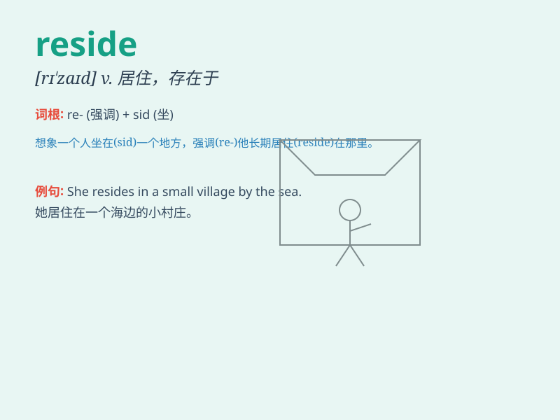

## reside

**英音:** _[rɪ\'zaɪd]_ **美音:** _[rɪ\'zaɪd]_

**译义:** *vi.居住*

### 短语

+ **reside in:** _存在于；在于_

+ **reside at:** _居住在（小地点）_

+ **reside with:** _与\...\...住在一起_

+ **permanent reside:** _永久居住_

+ **temporary reside:** _临时居住_

### 例句

#### 例句1

> **He resides in a small town in the countryside.**

**中文翻译:** 他居住在乡下的一个小镇上。

**单词释义:** 居住

#### 例句2

> **The power to make decisions resides with the board of
directors.**

**中文翻译:** 做决策的权力在于董事会。

**单词释义:** 在于

#### 例句3

> **Most of the problems reside in poor communication.**

**中文翻译:** 大多数问题在于沟通不畅。

**单词释义:** 在于

### 背诵小故事

> A little prince resides in a big castle. He loves the peaceful life
there. Every day, he enjoys the beautiful views and feels happy.
\'Reside\' means to live in a particular place.

**一位小王子居住在一座大城堡里。他喜欢那里平静的生活。每天，他欣赏美丽的景色，感到很快乐。'reside'意思是居住在某个特定的地方。**

### 图义

