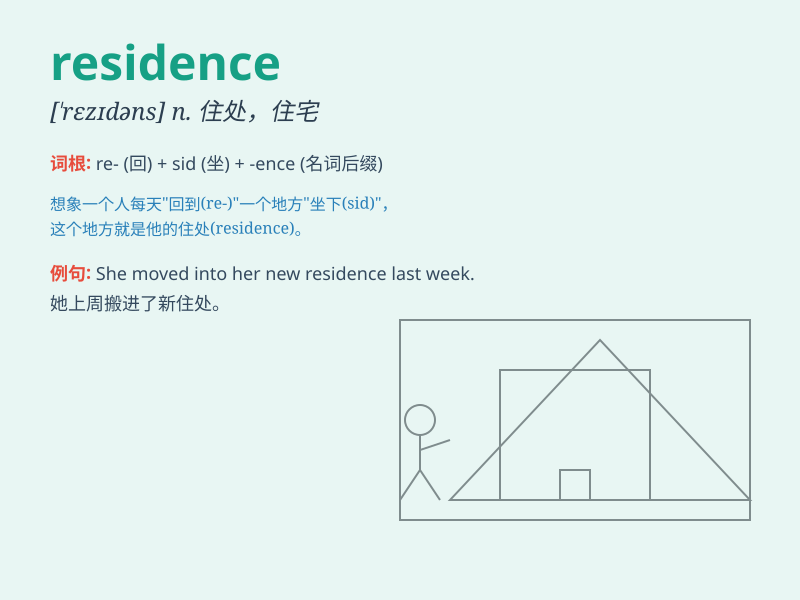

## residence

**英音:** _[\'rezɪd(ə)ns]_ **美音:** _[\'rɛzɪdəns]_

**译义:** *n.居住,住处*

### 短语

+ **permanent residence:** _永久居留_

+ **official residence:** _官邸_

+ **residence permit:** _居留许可证_

+ **domestic residence:** _国内住所_

+ **rural residence:** _农村住宅_

### 例句

#### 例句1

> **She has a luxurious residence in the countryside.**

**中文翻译:** 她在乡下有一座豪华的住宅。

**单词释义:** 住宅；住处

#### 例句2

> **The president\'s residence was surrounded by security guards.**

**中文翻译:** 总统的官邸被保安人员包围着。

**单词释义:** 官邸；住所

#### 例句3

> **After years of traveling, he finally settled in a peaceful
residence by the sea.**

**中文翻译:** 经过多年的旅行，他最终在海边一个宁静的住处定居下来。

**单词释义:** 居住；定居处

### 背诵小故事

> A prince was tired of traveling and decided to find a residence. He
searched everywhere and finally found a beautiful castle. There, he felt
at peace and called it his residence.

**一位王子厌倦了旅行，决定找一个住所。他四处寻找，最后找到了一座美丽的城堡。在那里，他感到平静，并称之为他的住所。**

### 图义

