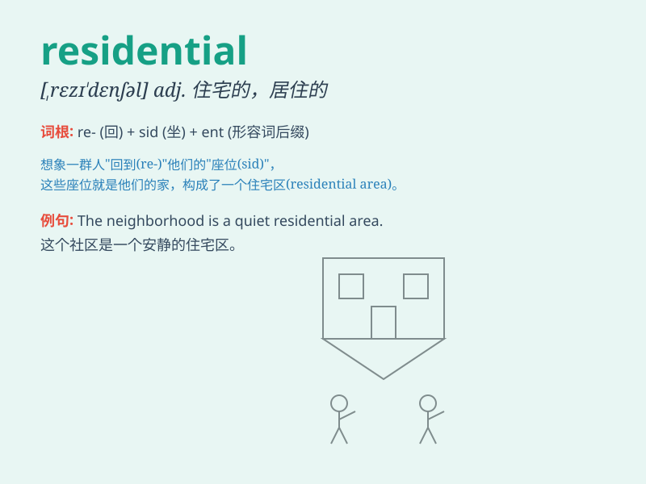

## residential

**英音:** _[rezɪ\'denʃ(ə)l]_ **美音:** _[,rɛzɪ\'dɛnʃl]_

**译义:** *adj.住宅的,与居住有关的*

### 短语

+ **residential area:** _居民区；住宅区_

+ **residential building:** _住宅建筑_

+ **residential district:** _居住区；住宅区_

+ **residential property:** _住宅物业；住宅房地产_

+ **residential street:** _住宅街道_

### 例句

#### 例句1

> **This area is mainly residential, with few commercial
buildings.**

**中文翻译:** 这个地区主要是住宅区，商业建筑很少。

**单词释义:** 住宅的；居住的

#### 例句2

> **The new development will consist of residential and commercial
properties.**

**中文翻译:** 新的开发项目将包括住宅和商业地产。

**单词释义:** 住宅的

#### 例句3

> **She lives in a quiet residential street.**

**中文翻译:** 她住在一条安静的住宅街道上。

**单词释义:** 居住的；住宅区的

### 背诵小故事

> A young man was looking for a new place to live. He wanted a
residential area that was quiet and safe. Finally, he found a perfect
home in a peaceful neighborhood. Now he enjoys his calm and comfortable
residential life.

**一个年轻人正在寻找新的居住地。他想要一个安静且安全的住宅区。最终，他在一个宁静的社区找到了完美的家。现在他享受着平静舒适的居住生活。**

### 图义

