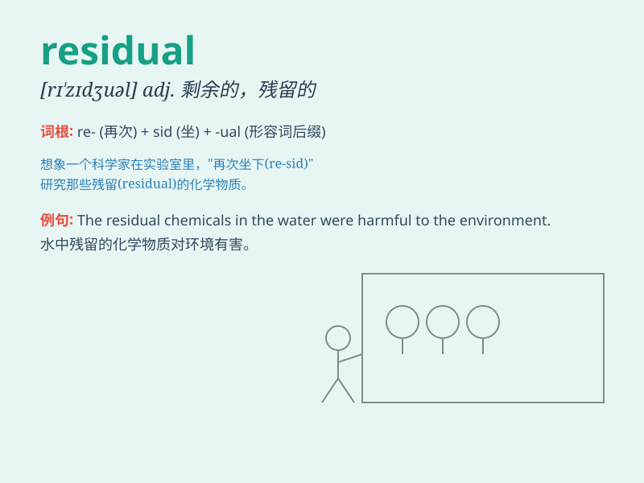

## residual

**英音:** _[rɪ\'zɪdjʊəl]_ **美音:** _[rɪ\'zɪdʒuəl]_

**译义:** *adj.剩余的,残留的*

### 短语

+ **residual income:** _剩余收益；剩余所得_

+ **residual stress:** _残余应力_

+ **residual value:** _剩余价值；残值_

+ **residual error:** _残差；剩余误差_

+ **residual risk:** _剩余风险_

### 例句

#### 例句1

> **The residual effects of the medication lasted for several
days.**

**中文翻译:** 这种药物的残留效应持续了好几天。

**单词释义:** 残留的；剩余的

#### 例句2

> **There is still a residual problem that needs to be addressed.**

**中文翻译:** 仍然有一个剩余的问题需要解决。

**单词释义:** 剩余的；残留的

#### 例句3

> **The company managed to make a profit despite the residual
debts.**

**中文翻译:** 尽管有剩余债务，这家公司还是设法盈利了。

**单词释义:** 剩余的；残留的

### 背诵小故事

>
想象一个工厂，生产完产品后总会剩下一些材料，这些剩下的材料就是\'residual\'。就像工人下班了，这些剩余材料还留在那里。它们是生产过程中未被完全使用的部分。

**想象一个工厂生产后剩余的材料来辅助记忆\'residual\'这个单词，意为剩余的；残留的**

### 图义

