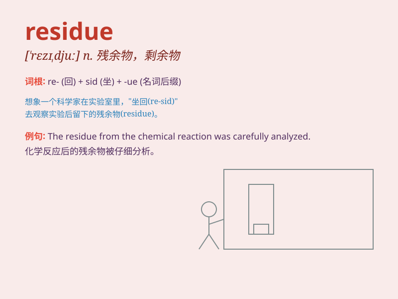

## residue

**英音:** _[\'rezɪdjuː]_ **美音:** _[\'rɛzɪdu]_

**译义:** *n.残余,渣滓,滤渣,残数,剩余物*

### 短语

+ **residue analysis:** _残渣分析；残留物分析_

+ **petroleum residue:** _石油残渣_

+ **solid residue:** _固体残渣_

+ **mineral residue:** _矿物残渣_

+ **carbon residue:** _碳残渣_

### 例句

#### 例句1

> **The residue of the chemical reaction was carefully analyzed.**

**中文翻译:** 化学反应的残留物被仔细地分析。

**单词释义:** 残留物

#### 例句2

> **There was a residue of dirt on the floor after cleaning.**

**中文翻译:** 清洁后地板上仍有污垢的残留。

**单词释义:** 残留；残余

#### 例句3

> **The wine had a strange residue at the bottom of the bottle.**

**中文翻译:** 这瓶酒在瓶底有奇怪的沉淀物。

**单词释义:** 沉淀物

### 背诵小故事

> A scientist was doing an experiment. After the process, there was
some substance left in the flask. This remaining part was called the
residue. It was like the leftover bits that still had value to study.

**一位科学家正在做实验。实验过程结束后，烧瓶里还剩下一些物质。这剩余的部分被称为残渣。它就像是仍有研究价值的剩余部分。**

### 图义

