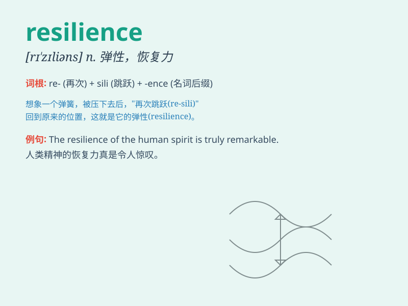

## resilience

**英音:** _[rɪ\'zɪlɪəns]_ **美音:** _[rɪˈzɪliəns]_

**译义:** *n.弹回,有弹力,恢复力,顺应力,轻快,达观,愉快的心情*

### 短语

+ **psychological resilience:** _心理韧性_

+ **emotional resilience:** _情绪适应力_

+ **build resilience:** _建立韧性_

+ **resilience capacity:** _恢复能力_

+ **show resilience:** _展现韧性_

### 例句

#### 例句1

> **She showed remarkable resilience in the face of adversity.**

**中文翻译:** 她在逆境中表现出了非凡的韧性。

**单词释义:** 韧性；适应力

#### 例句2

> **The resilience of the economy helped it recover quickly from the
crisis.**

**中文翻译:** 经济的弹性帮助它从危机中迅速恢复。

**单词释义:** 弹性；恢复力

#### 例句3

> **His mental resilience allowed him to overcome the trauma.**

**中文翻译:** 他的精神韧性使他能够克服创伤。

**单词释义:** 韧性；坚韧

### 背诵小故事

> A little tree was often beaten by strong winds but never broke. It
always bounced back. This shows resilience -- the ability to recover
quickly from difficulties.

**一棵小树经常被强风吹打但从未折断。它总是能恢复原状。这展现了"resilience"------从困境中迅速恢复的能力。**

### 图义

