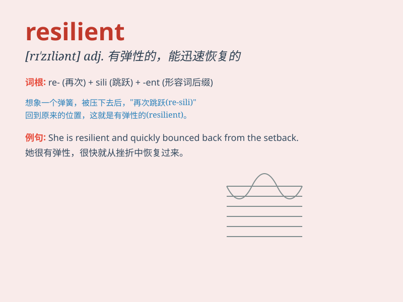

## resilient

**英音:** _[rɪ\'zɪlɪənt]_ **美音:** _[rɪ\'zɪlɪənt]_

**译义:** *adj.弹回的,有回弹力的*

### 短语

+ **resilient material:** _弹性材料_

+ **resilient personality:** _坚韧的性格_

+ **resilient economy:** _有弹性的经济_

+ **resilient spirit:** _不屈的精神_

+ **resilient response:** _有韧性的回应_

### 例句

#### 例句1

> **The resilient athlete recovered quickly from the injury.**

**中文翻译:** 这位有韧性的运动员很快从伤病中恢复了过来。

**单词释义:** 有韧性的；能复原的

#### 例句2

> **The economy proved resilient in the face of the global
crisis.**

**中文翻译:** 在全球危机面前，经济表现出了韧性。

**单词释义:** 有适应力的；有弹性的

#### 例句3

> **She has a resilient personality and never gives up easily.**

**中文翻译:** 她性格坚韧，从不轻易放弃。

**单词释义:** 坚韧不拔的

### 背诵小故事

> Once upon a time, a little tree faced strong winds and heavy rain.
But it was resilient and always bounced back. It grew stronger and
stronger. Just like this tree, resilient means being able to recover
quickly from difficulties.

**从前，有一棵小树面临强风和大雨。但它很有韧性，总是能恢复过来。它变得越来越强壮。就像这棵树一样，resilient
这个词意味着能够迅速从困难中恢复。**

### 图义

