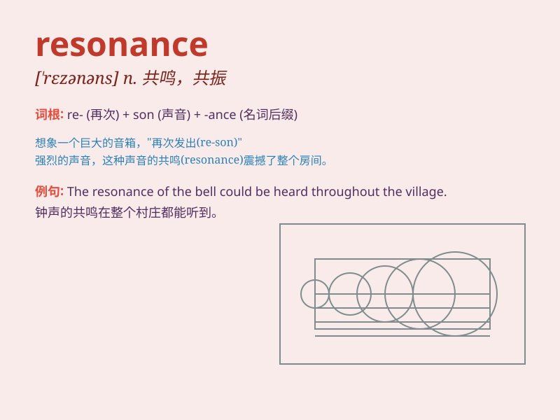

## resonance

**英音:** _[\'rez(ə)nəns]_ **美音:** _[\'rɛznəns]_

**译义:**
*n.共鸣,回声,反响,中介,谐振,共振,共振子,极短命的不稳定基本粒子*

### 短语

+ **magnetic resonance:** _磁共振_

+ **resonance frequency:** _共振频率_

+ **electron resonance:** _电子共振_

+ **nuclear magnetic resonance:** _核磁共振_

+ **acoustic resonance:** _声学共振_

### 例句

#### 例句1

> **The singer\'s voice had a remarkable resonance that filled the
concert hall.**

**中文翻译:** 这位歌手的嗓音有着非凡的共鸣，充满了整个音乐厅。

**单词释义:** 共鸣；共振

#### 例句2

> **The idea found resonance among the younger generation.**

**中文翻译:** 这个想法在年轻一代中引起了共鸣。

**单词释义:** 共鸣；反响

#### 例句3

> **The resonance of the gong was deep and sonorous.**

**中文翻译:** 铜锣的共鸣深沉而响亮。

**单词释义:** 共振；共鸣

### 背诵小故事

> A musician played a beautiful melody. The sound waves filled the room
and created a powerful resonance. It was like the music was echoing and
vibrating within everything, making a deep and lasting impression.

**一位音乐家演奏了一段美妙的旋律。声波充满了房间，并产生了强烈的共鸣。就好像音乐在一切事物中回响和振动，留下了深刻而持久的印象。**

### 图义

