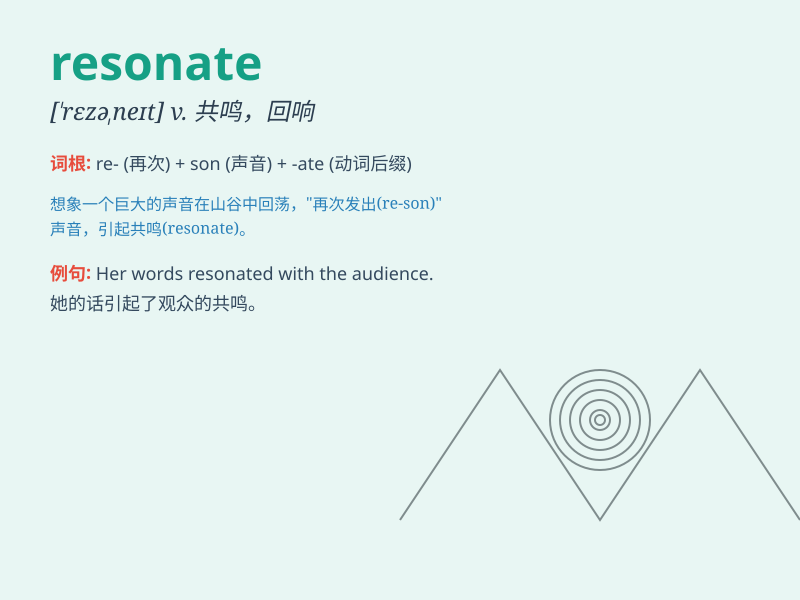

## resonate

**英音:** _[\'rez(ə)neɪt]_ **美音:** _[\'rɛzə\'net]_

**译义:** *v.(使)共鸣,(使)共振*

### 短语

+ **resonate with:** _与\...\...产生共鸣；引起\...\...的共鸣_

+ **resonate through:** _在\...\...中回荡；响彻\...\..._

+ **deeply resonate:** _深深共鸣_

+ **strongly resonate:** _强烈共鸣_

+ **emotionally resonate:** _在情感上产生共鸣_

### 例句

#### 例句1

> **The music resonated through the hall, captivating the
audience.**

**中文翻译:** 音乐在大厅里回荡，吸引了观众。

**单词释义:** （声音）回响，回荡

#### 例句2

> **Her words resonated with me, and I understood her feelings
completely.**

**中文翻译:** 她的话引起了我的共鸣，我完全理解她的感受。

**单词释义:** 引起共鸣，产生反响

#### 例句3

> **The idea of freedom resonates deeply within the hearts of all
people.**

**中文翻译:** 自由的理念在所有人的心中深深共鸣。

**单词释义:** （思想、情感等）产生共鸣

### 背诵小故事

>
想象一下，你在一个古老的城堡里弹吉他，声音在城堡的墙壁和通道中回荡。这声音的回荡就像\'resonate\'，表示共鸣、回响。就如同你的情感和想法在他人心中引起共鸣一样。

**想象在城堡里弹吉他，声音回荡的情景来辅助记忆\'resonate\'表示共鸣、回响的意思**

### 图义

