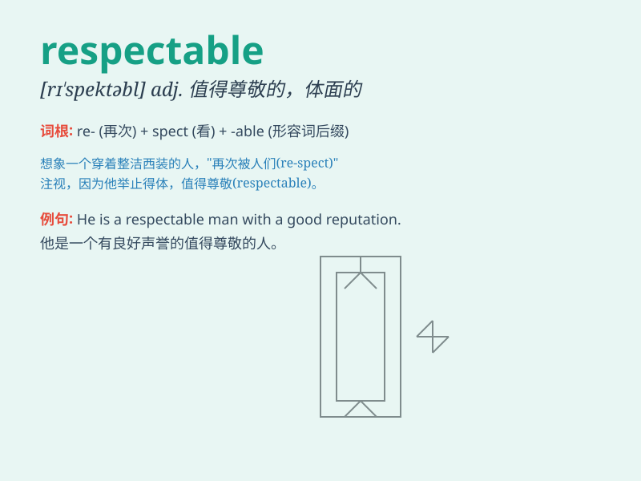

## respectable

**英音:** _[rɪ\'spektəb(ə)l]_ **美音:** _[rɪ\'spɛktəbl]_

**译义:** *adj.可敬的,有名望的,高尚的,值得尊敬的*

### 短语

+ **a respectable income:** _可观的收入_

+ **respectable appearance:** _体面的外表_

+ **a respectable family:** _受人尊敬的家庭_

+ **respectable profession:** _令人尊敬的职业_

+ **a respectable distance:** _相当远的距离_

### 例句

#### 例句1

> **She is a respectable teacher and is highly regarded by her
students.**

**中文翻译:** 她是一位受人尊敬的老师，深受学生们的敬重。

**单词释义:** 值得尊敬的

#### 例句2

> **The respectable gentleman always behaves politely in public.**

**中文翻译:** 这位可敬的绅士在公共场合总是举止有礼。

**单词释义:** 可敬的

#### 例句3

> **They live in a respectable neighborhood.**

**中文翻译:** 他们住在一个体面的社区。

**单词释义:** 体面的

### 背诵小故事

> A young man always dressed neatly and behaved politely. His good
conduct made him respectable. People trusted and admired him. One day,
he helped an old lady cross the street, showing his respectable nature
again.

**一个年轻人总是穿着整洁，举止有礼。他良好的行为使他值得尊敬。人们信任并钦佩他。有一天，他帮助一位老太太过马路，再次展现了他令人尊敬的品质。**

### 图义

