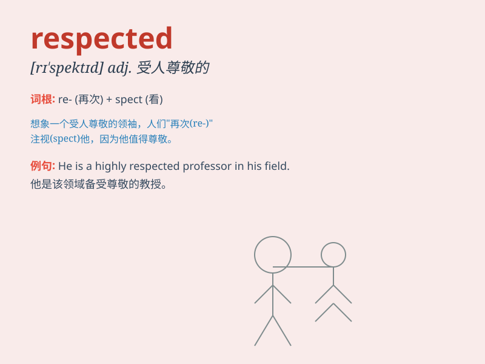

## respected

**英音:** _[rɪˈspektɪd]_ **美音:** _[rɪˈspektɪd]_

**译义:** *adj. 受人尊敬的；受尊敬的；值得尊敬的*

### 短语

+ **be highly respected:** _备受尊敬_

+ **widely respected:** _广受尊敬_

+ **deeply respected:** _深受尊敬_

+ **respected figure:** _受尊敬的人物_

+ **respected authority:** _受尊敬的权威_

### 例句

#### 例句1

> **He is a highly respected scientist in his field.**

**中文翻译:** 他在他的领域是一位备受尊敬的科学家。

**单词释义:** 受尊敬的

#### 例句2

> **The respected judge made a fair decision.**

**中文翻译:** 这位受人尊敬的法官做出了公正的裁决。

**单词释义:** 受尊敬的

#### 例句3

> **She was respected for her kindness and wisdom.**

**中文翻译:** 她因善良和智慧而受到尊重。

**单词释义:** 受尊重的

### 背诵小故事

> In a small town, there was a wise old man. Everyone respected him. He
gave good advice and was kind. People listened to him carefully. Because
of his wisdom and kindness, he was highly respected.

**在一个小镇上，有一位睿智的老人。每个人都尊敬他。他给出好的建议并且很友善。人们都认真聆听他的话。因为他的智慧和善良，他备受尊敬。**

### 图义

