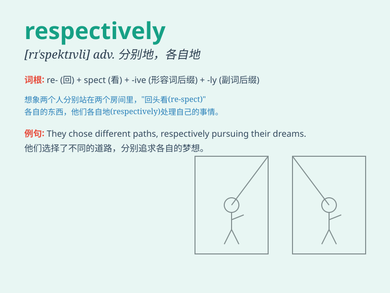

## respectively

**英音:** _[rɪ\'spektɪvlɪ]_ **美音:** _[rɪ\'spɛktɪvli]_

**译义:** *adv.分别地,各个地*

### 短语

+ **in order respectively:** _按顺序分别_

+ **be named respectively:** _分别被命名_

+ **divided respectively:** _分别划分_

+ **listed respectively:** _分别列出_

+ **explained respectively:** _分别解释_

### 例句

#### 例句1

> **The first and second prizes went to Mary and George
respectively.**

**中文翻译:** 一等奖和二等奖分别颁给了玛丽和乔治。

**单词释义:** 分别地

#### 例句2

> **John and Tom are 18 and 20 years old respectively.**

**中文翻译:** 约翰和汤姆分别是 18 岁和 20 岁。

**单词释义:** 分别地

#### 例句3

> **The profits of Company A and Company B increased by 10% and 15%
respectively last year.**

**中文翻译:** A 公司和 B 公司的利润去年分别增长了 10%和 15%。

**单词释义:** 分别地

### 背诵小故事

> A boy and a girl are running. The boy runs 100 meters and the girl
runs 80 meters respectively. It means each in the order given. So
respectively shows the correspondence between the two.

**一个男孩和一个女孩在跑步。男孩跑了 100 米，女孩跑了 80
米，分别地。这意味着按照给定的顺序各自。所以 respectively
表示两者之间的对应关系。**

### 图义

