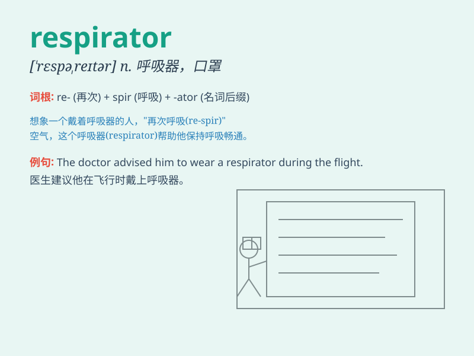

## respirator

**英音:** _[\'respɪreɪtə]_ **美音:** _[\'rɛspəretɚ]_

**译义:** *n.呼吸器*

### 短语

+ **gas respirator:** _防毒面具_

+ **dust respirator:** _防尘口罩_

+ **respirator mask:** _呼吸面罩_

+ **medical respirator:** _医用呼吸器_

+ **industrial respirator:** _工业用呼吸器_

### 例句

#### 例句1

> **The doctor wore a respirator during the surgery to protect
himself from infection.**

**中文翻译:** 医生在手术期间戴着呼吸器以保护自己免受感染。

**单词释义:** 呼吸器

#### 例句2

> **The fireman put on a respirator before entering the burning
building.**

**中文翻译:** 消防员在进入着火的大楼之前戴上了呼吸器。

**单词释义:** 呼吸器

#### 例句3

> **She was given a respirator to help her breathe properly after the
accident.**

**中文翻译:** 事故发生后，给她用了一个呼吸器来帮助她正常呼吸。

**单词释义:** 呼吸器

### 背诵小故事

> A brave astronaut was on a space mission. Suddenly, the spaceship\'s
air system failed. Luckily, he found a respirator and put it on quickly,
saving his life. The respirator provided the oxygen he needed to
breathe.

**一位勇敢的宇航员正在执行太空任务。突然，飞船的空气系统出现故障。幸运的是，他找到了一个呼吸器并迅速戴上，挽救了自己的生命。这个呼吸器为他提供了呼吸所需的氧气。**

### 图义

