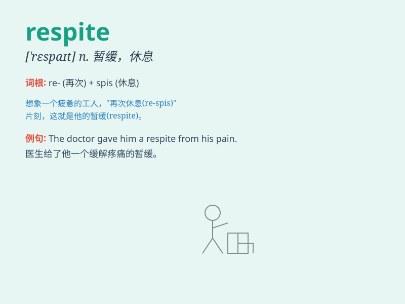

## respite

**英音:** _[\'respaɪt; -spɪt]_ **美音:** _[\'rɛspɪt]_

**译义:** *n.暂缓v.暂缓*

### 短语

+ **respite care:** _临时护理_

+ **grant respite:** _给予喘息机会_

+ **a brief respite:** _短暂的喘息_

+ **find respite:** _找到喘息之机_

+ **respite from work:** _工作中的休息_

### 例句

#### 例句1

> **The rain provided a brief respite from the heat.**

**中文翻译:** 这场雨给炎热带来了短暂的缓解。

**单词释义:** 缓解；暂时的休息

#### 例句2

> **The patient was granted a respite from the painful treatment.**

**中文翻译:** 病人从痛苦的治疗中获得了一次暂缓。

**单词释义:** 暂缓；间歇

#### 例句3

> **After weeks of hard work, she finally had a respite during the
vacation.**

**中文翻译:** 经过几周的辛苦工作，她终于在假期中有了一次休息。

**单词释义:** 休息；喘息的机会

### 背诵小故事

> A hardworking student was constantly stressed. One day, the teacher
gave him a short break, a respite. It was like a moment of relief from
the intense study. He felt refreshed and ready to continue.

**一位勤奋的学生一直处于压力之中。有一天，老师给了他一个短暂的休息，一个喘息的机会。这就像是从紧张的学习中得到了片刻的解脱。他感到精神焕发，准备继续学习。**

### 图义

