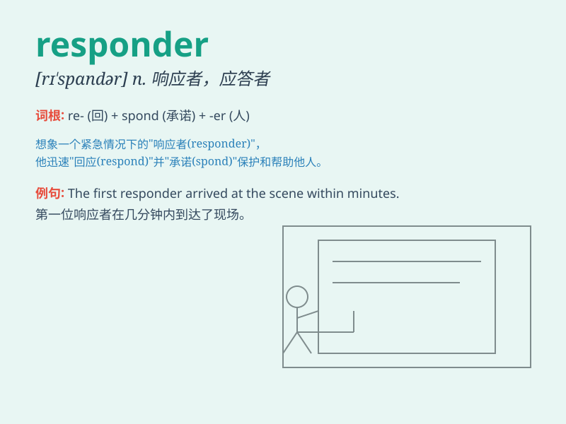

## responder

**英音:** _[rɪsˈpɒndə]_ **美音:** _[rɪˈspɑndər]_

**译义:** *n.回答者,回应者n.[电] 应答器,响应器*

### 短语

+ **first responder:**
_第一响应者（指在紧急情况中首先到达并提供援助的人，如消防员、警察、急救人员等）_

+ **emergency responder:** _应急响应人员_

+ **quick responder:** _快速响应者_

+ **effective responder:** _有效响应者_

+ **trained responder:** _受过训练的响应者_

### 例句

#### 例句1

> **The first responder arrived at the scene of the accident within
minutes.**

**中文翻译:** 第一位响应者在几分钟内到达了事故现场。

**单词释义:** 响应者；应答者

#### 例句2

> **She was a quick responder to the emergency call.**

**中文翻译:** 她对紧急呼叫反应迅速。

**单词释义:** 响应者；应答者

#### 例句3

> **The survey had a large number of responders.**

**中文翻译:** 这项调查有大量的回应者。

**单词释义:** 回应者；回答者

### 背诵小故事

> One day, a big fire broke out. Many people were in danger. The
responder, a brave firefighter, rushed to the scene immediately. He
fought the fire bravely and saved many lives.

**一天，一场大火爆发了。许多人处于危险之中。响应者，一位勇敢的消防员，立即赶到现场。他英勇地扑火并拯救了许多生命。**

### 图义

