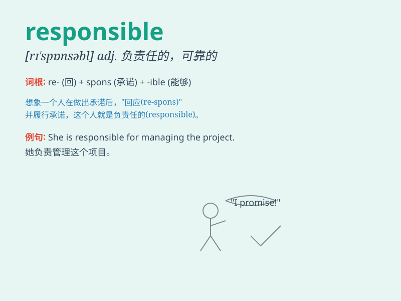

## responsible

**英音:** _[rɪ\'spɒnsɪb(ə)l]_ **美音:** _[rɪˈspɑnsəbəl]_

**译义:** *adj.有责任的,可靠的,可依赖的,负责的*

### 短语

+ **be responsible for:** _对\...\...负责；是\...\...的原因_

+ **responsible person:** _负责人；责任人_

+ **socially responsible:** _对社会负责的_

+ **environmentally responsible:** _对环境负责的_

+ **responsible behavior:** _负责任的行为_

### 例句

#### 例句1

> **He is responsible for the project\'s success.**

**中文翻译:** 他对这个项目的成功负责。

**单词释义:** 对\...\...负责

#### 例句2

> **The company is responsible for the environmental damage.**

**中文翻译:** 这家公司对环境损害负责。

**单词释义:** 对\...\...负责

#### 例句3

> **She is a responsible person.**

**中文翻译:** 她是一个有责任心的人。

**单词释义:** 有责任心的

### 背诵小故事

> One day, Tom was responsible for looking after the class pet. But he
forgot and the pet got lost. Tom felt very sorry. He learned that being
responsible means taking care of things properly.

**一天，汤姆负责照看班级宠物。但他忘了，宠物走丢了。汤姆感到非常抱歉。他明白了负责意味着妥善照顾事物。**

### 图义

