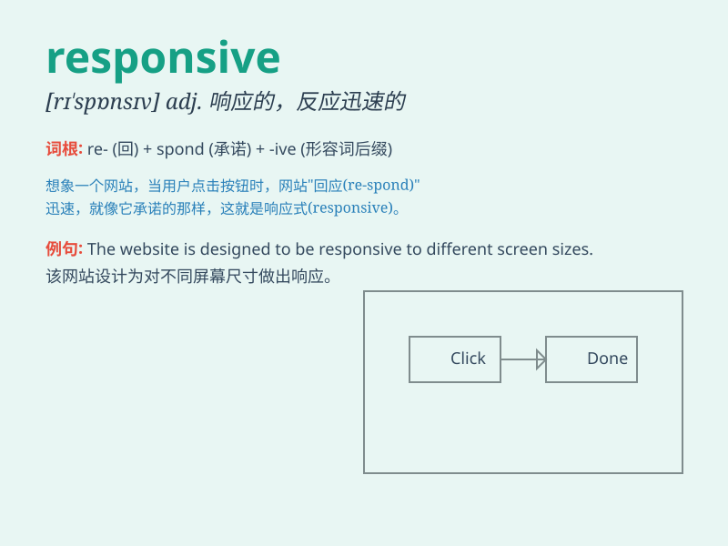

## responsive

**英音:** _[rɪ\'spɒnsɪv]_ **美音:** _[rɪ\'spɑnsɪv]_

**译义:** *adj.响应的,作出响应的*

### 短语

+ **be responsive to:** _对\...\...作出反应；对\...\...敏感_

+ **responsive design:** _响应式设计_

+ **responsive website:** _响应式网站_

+ **responsive service:** _响应迅速的服务_

+ **responsive interface:** _响应式界面_

### 例句

#### 例句1

> **The company is highly responsive to customer complaints.**

**中文翻译:** 这家公司对客户的投诉反应非常迅速。

**单词释义:** 反应迅速的

#### 例句2

> **The website is designed to be responsive, adapting to different
devices.**

**中文翻译:** 这个网站被设计成具有响应性，能适应不同的设备。

**单词释义:** 具有响应性的

#### 例句3

> **She is always responsive when her friends need help.**

**中文翻译:** 当她的朋友需要帮助时，她总是积极响应。

**单词释义:** 积极响应的

### 背诵小故事

>
想象一个国王，他的臣民向他提出各种需求。无论何时，国王都能迅速做出反应并给予帮助。这位国王就是\'responsive\'，总是积极响应臣民的需求。

**想象一位积极响应臣民需求的国王，来辅助记忆\'responsive\'（响应迅速的；积极响应的）这个单词**

### 图义

