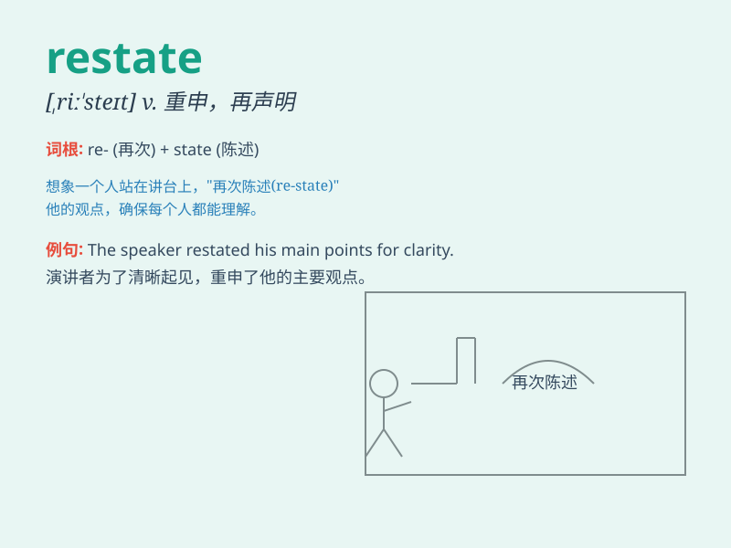

## restate

**英音:** _[riː\'steɪt]_ **美音:** _[,ri\'stet]_

**译义:** *vt.重新叙述,重申*

### 短语

+ **restate the problem:** _重新阐述问题_

+ **restate one\'s position:** _重申某人的立场_

+ **restate the argument:** _重新陈述论点_

+ **restate the facts:** _重新说明事实_

+ **restate the conclusion:** _重新表述结论_

### 例句

#### 例句1

> **The lawyer had to restate the client\'s case to make it more
clear.**

**中文翻译:** 这位律师不得不重新陈述客户的案子，以使它更清晰。

**单词释义:** 重新陈述

#### 例句2

> **Please restate your main point for those who didn\'t catch it the
first time.**

**中文翻译:** 请为那些第一次没听懂的人重新表述你的主要观点。

**单词释义:** 重新表述

#### 例句3

> **The professor asked the student to restate the theory in their
own words.**

**中文翻译:** 教授要求学生用他们自己的话重新陈述这个理论。

**单词释义:** 重新陈述

### 背诵小故事

> A student was asked to restate the important points of a lecture. But
he was confused at first. Then he took a deep breath and rephrased them
clearly. Finally, he got a high score.

**一名学生被要求重新陈述一堂讲座的重点。但他起初很困惑。然后他深吸一口气，清晰地重新表述了它们。最后，他得了高分。**

### 图义

