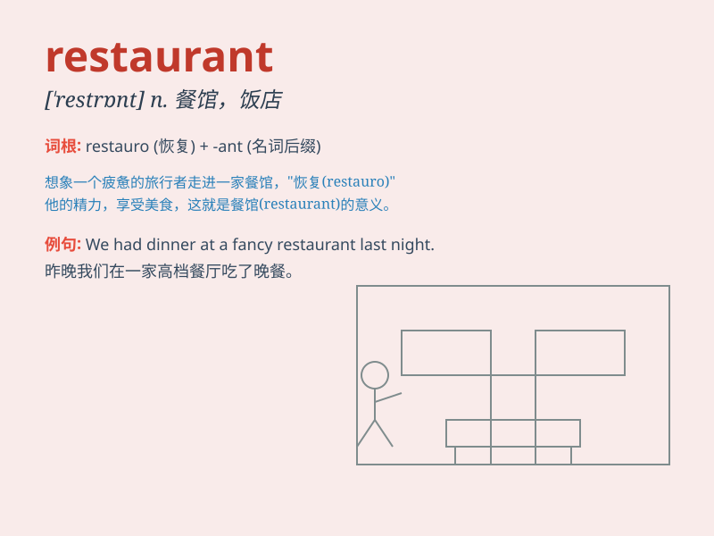

## restaurant

**英音:** _[ˈrestrɒnt]_ **美音:** _[ˈrestərənt;
rɛstərənt]_

**译义:** *n.餐馆,饭店*

### 短语

+ **fast food restaurant:** _快餐店_

+ **fancy restaurant:** _高档餐厅_

+ **self-service restaurant:** _自助餐厅_

+ **seafood restaurant:** _海鲜餐厅_

+ **Italian restaurant:** _意大利餐厅_

### 例句

#### 例句1

> **We went to a fancy restaurant for our anniversary.**

**中文翻译:** 我们在周年纪念日去了一家高档餐厅。

**单词释义:** 餐厅

#### 例句2

> **The new restaurant in town is always crowded.**

**中文翻译:** 镇上的新餐厅总是很拥挤。

**单词释义:** 餐厅

#### 例句3

> **I work as a waitress in a local restaurant.**

**中文翻译:** 我在当地一家餐厅当服务员。

**单词释义:** 餐厅

### 背诵小故事

> One day, Tom was very hungry. He walked along the street and finally
found a restaurant. The smell from inside was so inviting. He went in
and had a delicious meal. Now he always remembers \'restaurant\' as the
place that filled his stomach.

**一天，汤姆非常饿。他沿着街道走，终于发现了一家餐馆。里面飘出的香味十分诱人。他走进去，享用了一顿美味的饭菜。现在他总是把"restaurant"记成那个填饱他肚子的地方。**

### 图义

