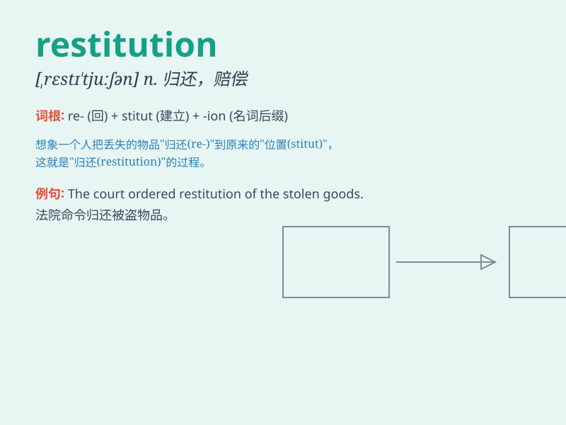

## restitution

**英音:** _[,restɪ\'tjuːʃ(ə)n]_ **美音:**
_[\'rɛstə\'tʊʃən]_

**译义:** *n.归还*

### 短语

+ **make restitution:** _进行赔偿；作出补偿_

+ **restitution payment:** _赔偿款；补偿款_

+ **restitution of property:** _财产归还_

+ **demand restitution:** _要求赔偿_

+ **receive restitution:** _得到赔偿；获得补偿_

### 例句

#### 例句1

> **The thief was ordered to make restitution to the victim.**

**中文翻译:** 这个小偷被命令向受害者做出赔偿。

**单词释义:** 赔偿；补偿

#### 例句2

> **The company provided restitution for the damage caused by their
faulty product.**

**中文翻译:** 该公司为其有缺陷的产品所造成的损害提供了赔偿。

**单词释义:** 赔偿；补偿

#### 例句3

> **The museum is seeking restitution of the stolen artifacts.**

**中文翻译:** 博物馆正在寻求被盗文物的归还。

**单词释义:** 归还（被非法或不正当拿走的财物）

### 背诵小故事

> A thief stole a precious necklace. But later, feeling guilty, he made
restitution by returning it. The owner was relieved and forgave him.
Remember, restitution means giving back what was wrongly taken.

**一个小偷偷了一条珍贵的项链。但后来，他感到内疚，通过归还项链做出了赔偿。主人松了一口气并原谅了他。记住，restitution
意思是归还被非法拿走的东西。**

### 图义

