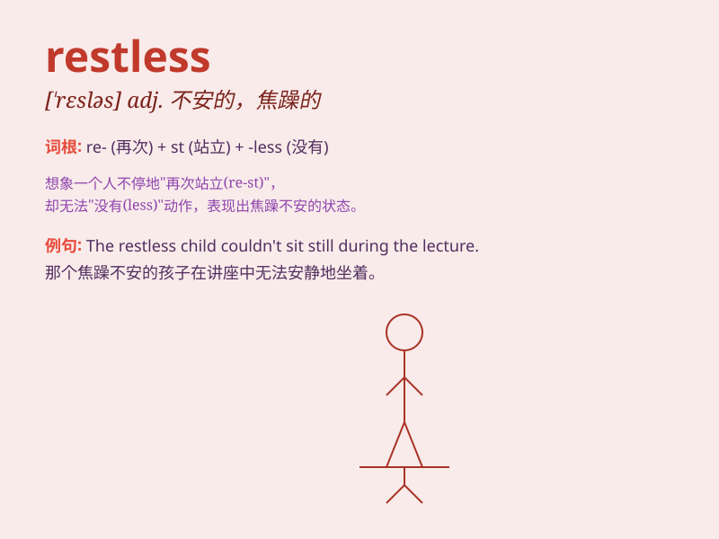

## restless

**英音:** _[ˈrestləs]_ **美音:** _[\'rɛstləs]_

**译义:** *adj.得不到休息的,不平静的,不安宁的*

### 短语

+ **restless nights:** _不眠之夜_

+ **restless mind:** _不安的思绪_

+ **restless spirit:** _躁动的精神_

+ **restless child:** _好动的孩子_

+ **restless energy:** _过剩的精力_

### 例句

#### 例句1

> **He was feeling restless and couldn\'t sit still.**

**中文翻译:** 他感到焦躁不安，无法安静地坐着。

**单词释义:** 焦躁不安的

#### 例句2

> **The restless child kept running around the room.**

**中文翻译:** 这个不安分的孩子一直在房间里跑来跑去。

**单词释义:** 不安分的

#### 例句3

> **She had a restless night, tossing and turning in bed.**

**中文翻译:** 她度过了一个不安宁的夜晚，在床上辗转反侧。

**单词释义:** 不安宁的

### 背诵小故事

> One night, a little mouse was very restless. It couldn\'t stay still
in its hole. It kept running around, looking for something. Finally, it
realized it was just too excited about the new adventure tomorrow.

**一天晚上，一只小老鼠非常不安分。它在洞里待不住。不停地跑来跑去，寻找着什么。最后，它意识到自己只是对明天的新冒险太兴奋了。**

### 图义

