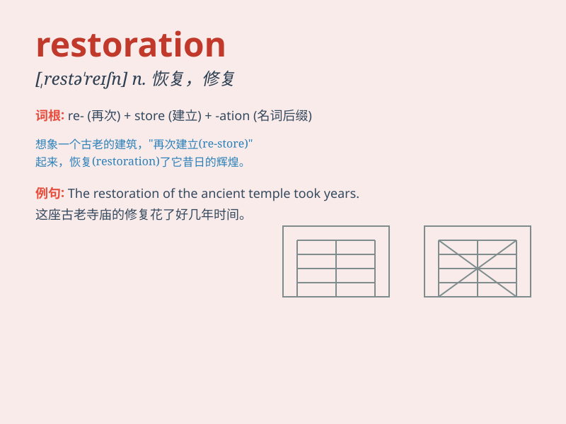

## restoration

**英音:** _[restə\'reɪʃ(ə)n]_ **美音:**
_[\'rɛstə\'reʃən]_

**译义:** *n.恢复,归还,复位,复职,赔偿,修补,重建,修复物*

### 短语

+ **restoration work:** _修复工作_

+ **historical restoration:** _历史修复_

+ **restoration project:** _修复项目_

+ **environmental restoration:** _环境恢复_

+ **restoration of health:** _健康的恢复_

### 例句

#### 例句1

> **The restoration of the old castle took several years.**

**中文翻译:** 这座古老城堡的修复花了好几年。

**单词释义:** 修复；恢复

#### 例句2

> **The government is committed to the restoration of law and
order.**

**中文翻译:** 政府致力于恢复法律和秩序。

**单词释义:** 恢复

#### 例句3

> **The restoration of his health was a slow process.**

**中文翻译:** 他健康的恢复是一个缓慢的过程。

**单词释义:** 恢复

### 背诵小故事

> A king lost his throne and his kingdom was in chaos. But with the
efforts of brave knights and wise advisors, the kingdom achieved
restoration. Everything returned to normal, and the king sat on his
throne again.

**一位国王失去了王位，他的王国陷入混乱。但在勇敢的骑士和睿智的顾问的努力下，王国实现了恢复。一切都回归正常，国王再次坐上了王位。**

### 图义

