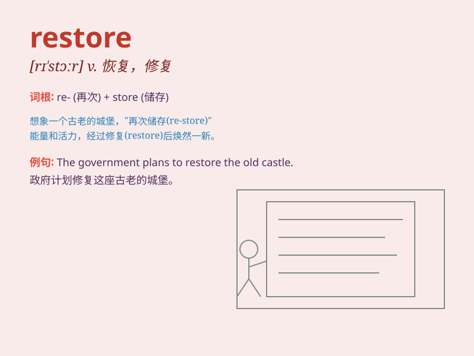

## restore

**英音:** _[rɪ\'stɔː]_ **美音:** _[rɪ\'stɔr]_

**译义:** *vt.恢复,使回复,归还,交还,修复,重建*

### 短语

+ **restore confidence:** _恢复信心_

+ **restore order:** _恢复秩序_

+ **restore health:** _恢复健康_

+ **restore balance:** _恢复平衡_

+ **restore memory:** _恢复记忆_

### 例句

#### 例句1

> **The government is working to restore public confidence in the
economy.**

**中文翻译:** 政府正在努力恢复公众对经济的信心。

**单词释义:** 恢复

#### 例句2

> **She was able to restore the old chair to its original
condition.**

**中文翻译:** 她能够把那把旧椅子修复到原来的状态。

**单词释义:** 修复；使复原

#### 例句3

> **After the flood, efforts were made to restore normal life in the
affected areas.**

**中文翻译:** 洪水过后，人们努力在受灾地区恢复正常生活。

**单词释义:** 恢复

### 背诵小故事

> Once upon a time, a precious old painting was damaged. But a skilled
artist came and used special techniques to restore it to its original
beauty. Just like that, \'restore\' means to bring back to its former
state.

**从前，一幅珍贵的旧画受损了。但一位技艺精湛的艺术家来了，用特殊的技术将其恢复到原来的美丽。就像这样，'restore'意思是使恢复原状。**

### 图义

