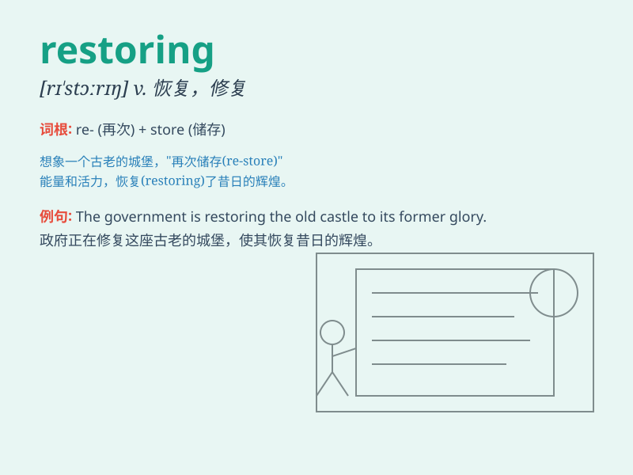

## restoring

**英音:** _[rɪˈstɔːrɪŋ]_ **美音:** _[rɪˈstɔːrɪŋ]_

**译义:** *v.恢复；修复；归还（restore的现在分词）*

### 短语

+ **restoring force:** _恢复力；回复力_

+ **restoring balance:** _恢复平衡_

+ **restoring health:** _恢复健康_

+ **restoring confidence:** _恢复信心_

+ **restoring order:** _恢复秩序_

### 例句

#### 例句1

> **The team is dedicated to restoring the historical building to its
former glory.**

**中文翻译:** 这个团队致力于将这座历史建筑恢复到其昔日的辉煌。

**单词释义:** 使恢复；修复

#### 例句2

> **Restoring the damaged ecosystem is a long and challenging
process.**

**中文翻译:** 恢复受损的生态系统是一个漫长且具有挑战性的过程。

**单词释义:** 恢复；修复

#### 例句3

> **She spent hours restoring the old photographs.**

**中文翻译:** 她花了几个小时修复那些旧照片。

**单词释义:** 修复；复原

### 背诵小故事

> A king\'s precious throne was damaged. Workers spent days restoring
it to its former glory. They fixed every part carefully, making it as
good as new. The act of restoring the throne made the king very happy.

**一位国王珍贵的王座损坏了。工人们花了好几天时间来修复它，使其恢复往日的辉煌。他们仔细地修复每一个部分，让它完好如新。修复王座的行为让国王非常高兴。**

### 图义

