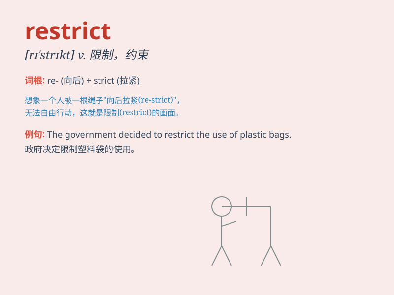

## restrict

**英音:** _[rɪ\'strɪkt]_ **美音:** _[rɪ\'strɪkt]_

**译义:** *vt.限制,约束,限定*

### 短语

+ **restrict access:** _限制进入；限制访问_

+ **restrict oneself:** _自我约束；自我限制_

+ **restrict movement:** _限制行动；限制移动_

+ **restrict trade:** _限制贸易_

+ **restrict spending:** _限制开支_

### 例句

#### 例句1

> **The government has restricted the use of certain chemicals in
food production.**

**中文翻译:** 政府已经限制了某些化学物质在食品生产中的使用。

**单词释义:** 限制

#### 例句2

> **My parents restricted my TV time when I was a kid.**

**中文翻译:** 当我还是孩子的时候，我父母限制了我看电视的时间。

**单词释义:** 限制

#### 例句3

> **The speed limit restricts how fast you can drive on this
road.**

**中文翻译:** 速度限制规定了你在这条路上能开多快。

**单词释义:** 限制

### 背诵小故事

> A king wanted to restrict the access to his treasure room. He put up
many barriers and guards. Only those with special permission could
enter. \'Restrict\' means to limit or keep within certain boundaries.

**一位国王想要限制进入他的宝藏室。他设置了许多障碍和守卫。只有那些有特殊许可的人才能进入。\'restrict\'
意思是限制或控制在一定范围内。**

### 图义

