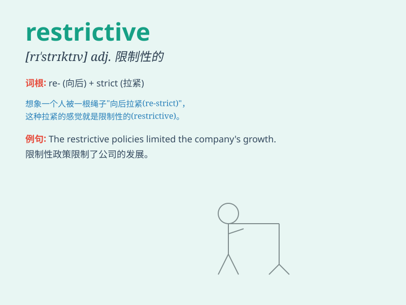

## restrictive

**英音:** _[rɪ\'strɪktɪv]_ **美音:** _[rɪ\'strɪktɪv]_

**译义:** *adj.限制性的*

### 短语

+ **restrictive measure:** _限制性措施_

+ **restrictive policy:** _限制性政策_

+ **restrictive practice:** _限制性做法_

+ **restrictive clause:** _限制性从句_

+ **restrictive diet:** _限制性饮食_

### 例句

#### 例句1

> **The new law is highly restrictive and limits individual
freedoms.**

**中文翻译:** 新的法律非常具有限制性，限制了个人自由。

**单词释义:** 限制的；约束的

#### 例句2

> **The company has restrictive policies regarding employee
benefits.**

**中文翻译:** 这家公司在员工福利方面有严格的政策。

**单词释义:** 严格的；约束性的

#### 例句3

> **The dress code at the event was quite restrictive.**

**中文翻译:** 该活动的着装要求相当严格。

**单词释义:** 严格的；限制的

### 背诵小故事

> A little bird wanted to fly freely but was caught in a restrictive
cage. It couldn\'t spread its wings. Just like some rules that limit our
freedom, \'restrictive\' means causing a limit or restriction.

**一只小鸟想要自由飞翔，却被困在一个限制性的笼子里。它无法展开翅膀。就像一些限制我们自由的规则，\'restrictive\'意思是造成限制或约束。**

### 图义

