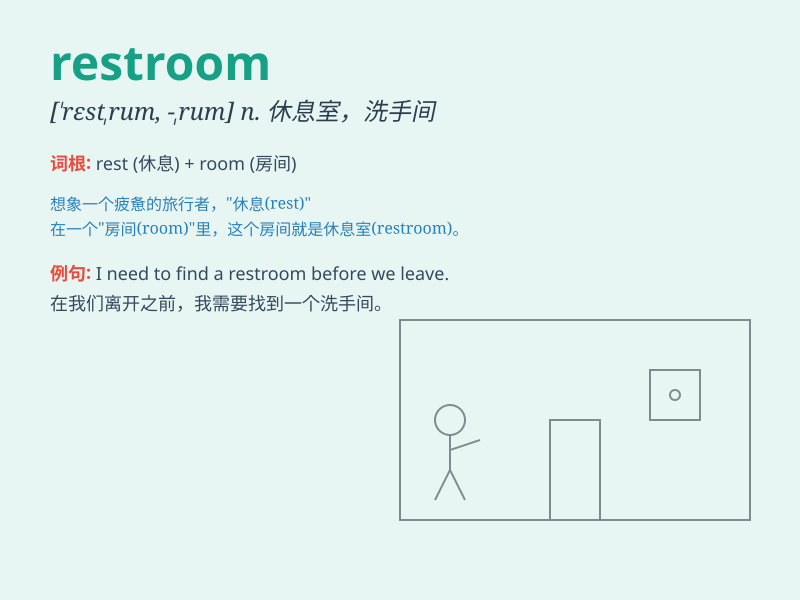

## restroom

**英音:** _[ˈrestruːm]_ **美音:** _[ˈrɛstˌrum]_

**译义:** *n. 洗手间；厕所*

### 短语

+ **public restroom:** _公共卫生间_

+ **clean restroom:** _干净的洗手间_

+ **men\'s restroom:** _男洗手间_

+ **women\'s restroom:** _女洗手间_

+ **accessible restroom:** _无障碍洗手间_

### 例句

#### 例句1

> **I need to use the restroom.**

**中文翻译:** 我需要使用洗手间。

**单词释义:** 洗手间

#### 例句2

> **The restroom is at the end of the hallway.**

**中文翻译:** 洗手间在走廊的尽头。

**单词释义:** 洗手间

#### 例句3

> **Is there a clean restroom nearby?**

**中文翻译:** 附近有干净的洗手间吗？

**单词释义:** 洗手间

### 背诵小故事

> One day, Tom was in a big shopping mall and suddenly needed to go. He
asked a staff member where he could find a place to relieve himself. The
staff pointed him to the restroom. Tom was so relieved to know where to
go.

**有一天，汤姆在一个大型购物中心，突然内急。他问一名工作人员哪里可以方便。工作人员给他指了去洗手间的方向。汤姆知道去哪儿后，松了一口气。**

### 图义

