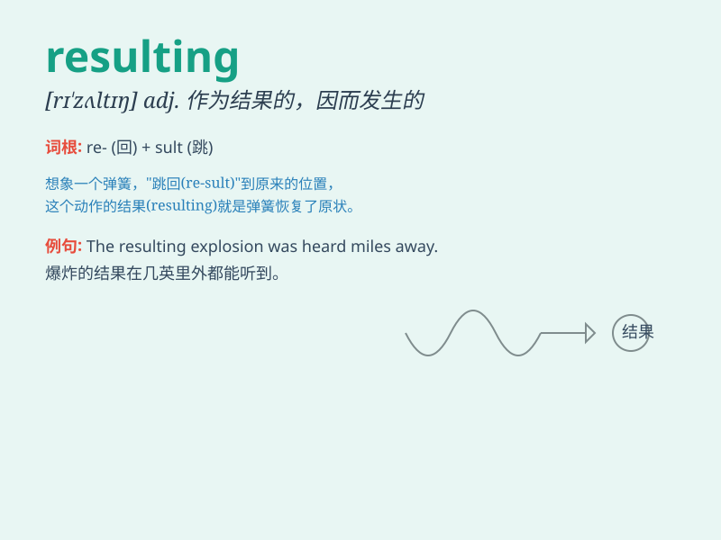

## resulting

**英音:** _[rɪ\'zʌltɪŋ]_ **美音:** _[rɪ\'zʌlt]_

**译义:** *adj.作为结果的,因而发生的*

### 短语

+ **resulting damage:** _造成的损害_

+ **resulting effect:** _最终效果_

+ **resulting situation:** _由此产生的情况_

+ **resulting outcome:** _最终结果_

+ **resulting profit:** _所得利润_

### 例句

#### 例句1

> **The resulting chaos was difficult to control.**

**中文翻译:** 由此产生的混乱局面难以控制。

**单词释义:** 由此产生的

#### 例句2

> **The resulting damage from the earthquake was extensive.**

**中文翻译:** 地震造成的破坏范围很广。

**单词释义:** 造成的

#### 例句3

> **The resulting increase in profits was beyond our
expectations.**

**中文翻译:** 由此带来的利润增长超出了我们的预期。

**单词释义:** 由此带来的

### 背诵小故事

> A brave scientist conducted many experiments. The actions he took
were complex, but the resulting outcome was a wonderful discovery that
changed the world. It means caused by something that has happened
before.

**一位勇敢的科学家进行了许多实验。他采取的行动很复杂，但由此产生的结果是一个改变世界的奇妙发现。它指的是由之前发生的事情所导致的。**

### 图义

