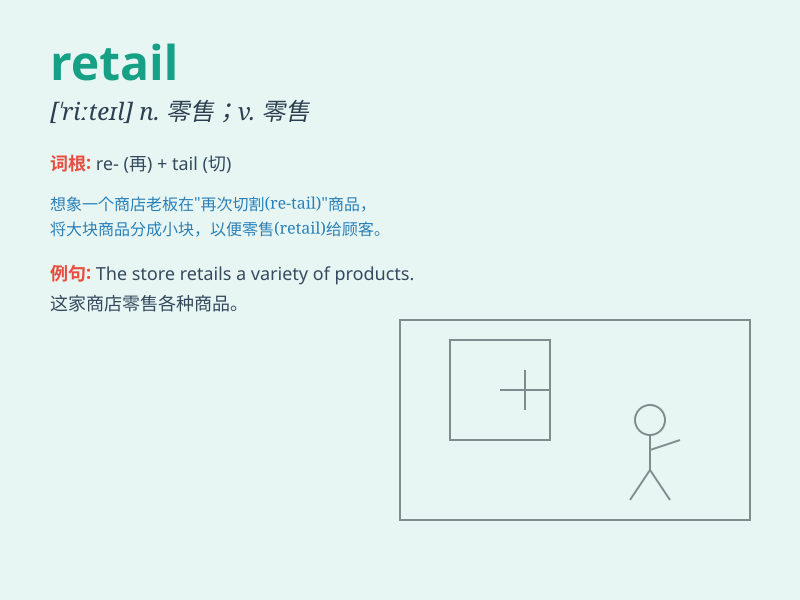

## retail

**英音:** _[\'riːteɪl]_ **美音:** _[\'ritel]_

**译义:** *n.零售adj.零售的vt.零售,转述vi.零售adv.以零售方式*

### 短语

+ **retail business:** _零售业务_

+ **retail price:** _零售价格_

+ **retail store:** _零售店_

+ **retail market:** _零售市场_

+ **retail therapy:** _购物疗法_

### 例句

#### 例句1

> **The product is sold at retail for \$50.**

**中文翻译:** 该产品零售价格为 50 美元。

**单词释义:** 零售

#### 例句2

> **She works in retail and deals with customers every day.**

**中文翻译:** 她在零售业工作，每天与顾客打交道。

**单词释义:** 零售业

#### 例句3

> **The company decided to expand its retail operations.**

**中文翻译:** 公司决定扩大其零售业务。

**单词释义:** 零售

### 背诵小故事

> A small shop owner was always busy with retail. One day, a customer
came and bought many items. The owner was happy as retail brought him
income. He decided to expand his retail business.

**一位小店主总是忙于零售业务。有一天，一位顾客来了并买了很多东西。店主很高兴，因为零售给他带来了收入。他决定扩大他的零售业务。**

### 图义

