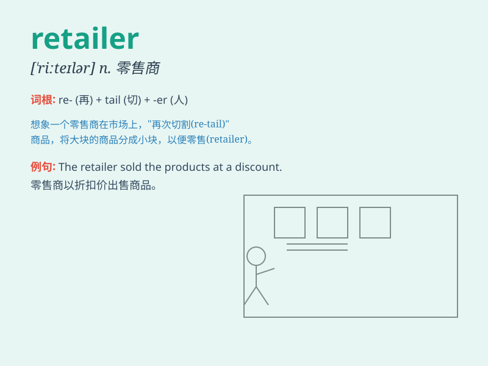

## retailer

**英音:** _[ˈriːteɪlə(r)]_ **美音:** _[ˈriːteɪlər]_

**译义:** *n.零售商人,传播的人*

### 短语

+ **online retailer:** _在线零售商_

+ **local retailer:** _当地零售商_

+ **major retailer:** _主要零售商_

+ **independent retailer:** _独立零售商_

+ **furniture retailer:** _家具零售商_

### 例句

#### 例句1

> **The retailer offers a wide range of products at discounted
prices.**

**中文翻译:** 这位零售商以折扣价提供各种各样的产品。

**单词释义:** 零售商

#### 例句2

> **We bought the furniture from a local retailer.**

**中文翻译:** 我们从当地的一家零售商那里买了家具。

**单词释义:** 零售商

#### 例句3

> **The online retailer has seen a significant increase in sales this
year.**

**中文翻译:** 这家在线零售商今年的销售额有了显著增长。

**单词释义:** 零售商

### 背诵小故事

> A young man wanted to start a business. He decided to become a
retailer. He bought goods from wholesalers and sold them in his small
store. Through hard work, his store became popular and he made a lot of
money.

**一个年轻人想要创业。他决定成为一名零售商。他从批发商那里进货，然后在他的小店里出售。通过努力，他的店变得受欢迎，他赚了很多钱。**

### 图义

