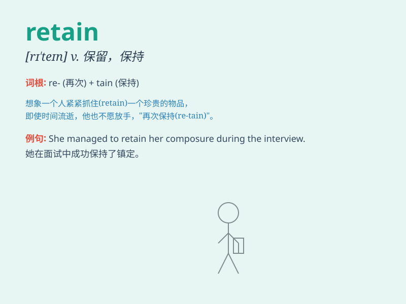

## retain

**英音:** _[rɪ\'teɪn]_ **美音:** _[rɪ\'ten]_

**译义:** *vt.保持,保留*

### 短语

+ **retain control:** _保持控制_

+ **retain information:** _保留信息_

+ **retain memory:** _保持记忆_

+ **retain customers:** _留住客户_

+ **retain employees:** _留住员工_

### 例句

#### 例句1

> **The company managed to retain its most valuable employees.**

**中文翻译:** 这家公司设法留住了其最有价值的员工。

**单词释义:** 保留；留住

#### 例句2

> **She struggled to retain her composure in the face of
criticism.**

**中文翻译:** 面对批评，她努力保持镇静。

**单词释义:** 保持；维持

#### 例句3

> **The old castle still retains some of its original charm.**

**中文翻译:** 这座古老的城堡仍然保留着一些它原有的魅力。

**单词释义:** 保存；保留

### 背诵小故事

>
想象一个国王，他有一个装满珍贵宝石的宝箱。为了永远拥有这些宝石的光芒，他努力地retain（保留）它们，不让任何人拿走，始终守护着这份珍贵。

**想象一位国王努力保留他装满珍贵宝石的宝箱，以此记住retain
有'保留；保持；保存'的意思**

### 图义

