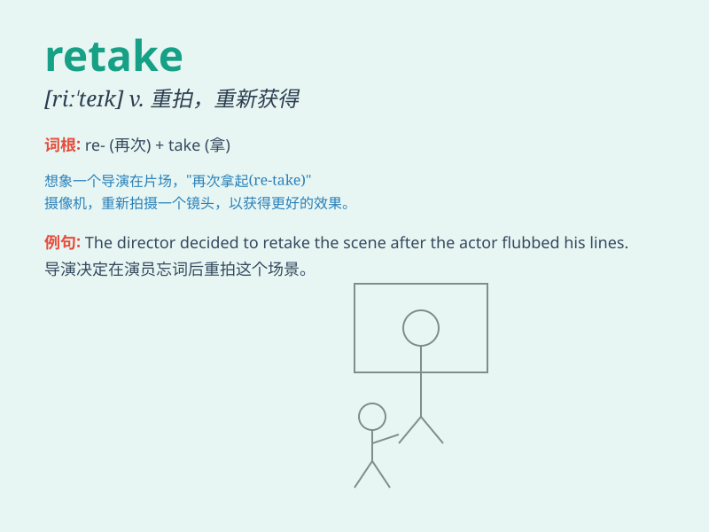

## retake

**英音:** _[riː\'teɪk]_ **美音:** _[,ri\'tek]_

**译义:** *vt.再取,取回,重摄n.取回*

### 短语

+ **retake an exam:** _重考；补考_

+ **retake a city:** _重新占领一座城市_

+ **retake the lead:** _重新领先_

+ **retake a photograph:** _重拍一张照片_

+ **retake a position:** _重新占据一个位置_

### 例句

#### 例句1

> **I failed the exam and had to retake it.**

**中文翻译:** 我考试不及格，不得不重考。

**单词释义:** 重考

#### 例句2

> **The army decided to retake the lost territory.**

**中文翻译:** 军队决定夺回失去的领土。

**单词释义:** 夺回

#### 例句3

> **The director asked the actor to retake the scene because of a
mistake.**

**中文翻译:** 导演因为一个错误要求演员重拍这个场景。

**单词释义:** 重拍

### 背诵小故事

> A student failed his exam and was very sad. But he decided to retake
it. He studied hard and finally passed. The word \'retake\' means to
take something again, like an exam or a test.

**一名学生考试不及格，非常伤心。但他决定重考。他努力学习，最终通过了。单词'retake'意思是再次参加，比如考试或测试。**

### 图义

