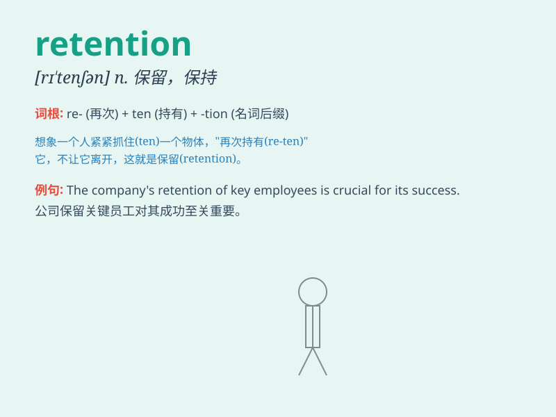

## retention

**英音:** _[rɪ\'tenʃ(ə)n]_ **美音:** _[rɪ\'tɛnʃən]_

**译义:** * 保持力*

### 短语

+ **customer retention:** _客户保留_

+ **retention rate:** _保留率；留存率_

+ **data retention:** _数据保留_

+ **employee retention:** _员工保留_

+ **retention period:** _保留期；保存期限_

### 例句

#### 例句1

> **The company focuses on employee retention to maintain a stable
workforce.**

**中文翻译:** 这家公司注重员工保留以维持稳定的劳动力。

**单词释义:** 保留

#### 例句2

> **Memory retention is an important aspect of learning.**

**中文翻译:** 记忆保持是学习的一个重要方面。

**单词释义:** 保持；保留

#### 例句3

> **The retention of water in the body can cause swelling.**

**中文翻译:** 体内水分的潴留会导致肿胀。

**单词释义:** 潴留；留存

### 背诵小故事

> A student was very worried about his retention of knowledge before
the exam. But he found that by making summaries and doing regular
reviews, he improved his retention greatly.

**一名学生在考试前非常担心他的知识留存情况。但他发现通过做总结和定期复习，他的知识留存能力大大提高了。**

### 图义

