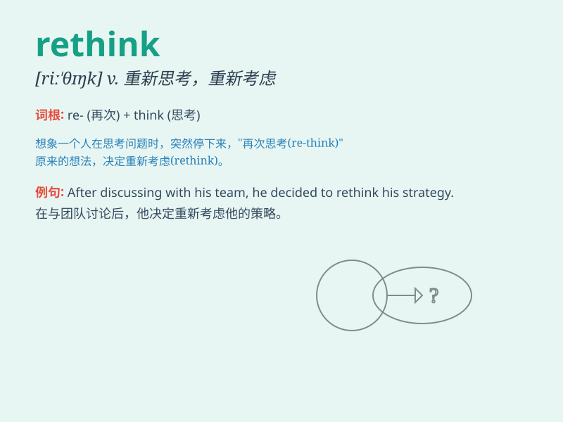

## rethink

**英音:** _[riː\'θɪŋk]_ **美音:** _[,ri\'θɪŋk]_

**译义:** *v.再想,重想*

### 短语

+ **rethink strategy:** _重新思考策略_

+ **rethink decision:** _重新考虑决定_

+ **rethink approach:** _重新思考方法_

+ **rethink position:** _重新考虑立场_

+ **rethink policy:** _重新思考政策_

### 例句

#### 例句1

> **We need to rethink our marketing strategy.**

**中文翻译:** 我们需要重新思考我们的营销策略。

**单词释义:** 重新思考

#### 例句2

> **After the failure, she began to rethink her career choice.**

**中文翻译:** 失败之后，她开始重新思考自己的职业选择。

**单词释义:** 重新思考

#### 例句3

> **It\'s time to rethink the way we handle this problem.**

**中文翻译:** 是时候重新思考我们处理这个问题的方式了。

**单词释义:** 重新思考

### 背诵小故事

> One day, Tom made a wrong decision at work. But later, he sat down
and began to rethink everything carefully. Finally, he found a better
way and solved the problem successfully.

**有一天，汤姆在工作中做了一个错误的决定。但后来，他坐下来开始仔细地重新思考一切。最后，他找到了一个更好的方法并成功解决了问题。**

### 图义

