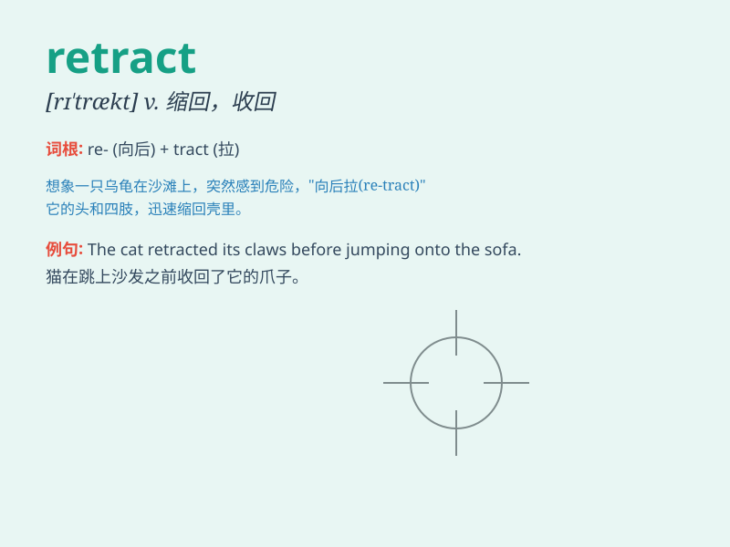

## retract

**英音:** _[rɪ\'trækt]_ **美音:** _[rɪ\'trækt]_

**译义:** *v.缩回,缩进,所卷(舌等),收回,取消,撤消*

### 短语

+ **retract a statement:** _收回声明_

+ **retract an offer:** _撤回提议_

+ **retract a promise:** _收回承诺_

+ **retract one\'s words:** _收回自己的话_

+ **retract a confession:** _撤回供词_

### 例句

#### 例句1

> **He retracted his previous statement.**

**中文翻译:** 他收回了他之前的陈述。

**单词释义:** 收回；撤回

#### 例句2

> **The cat retracted its claws.**

**中文翻译:** 这只猫缩回了它的爪子。

**单词释义:** 缩回；缩进

#### 例句3

> **She retracted her offer to help.**

**中文翻译:** 她收回了帮忙的提议。

**单词释义:** 取消；撤销

### 背诵小故事

> A little mouse was very brave and rushed out of the hole. But when it
saw a big cat, it quickly retracted back. Just like when we take back
our words or actions, that\'s what \'retract\' means.

**一只小老鼠非常勇敢地冲出了洞。但当它看到一只大猫时，它迅速缩了回去。就像我们收回自己的话或行动，这就是'retract'的意思。**

### 图义

