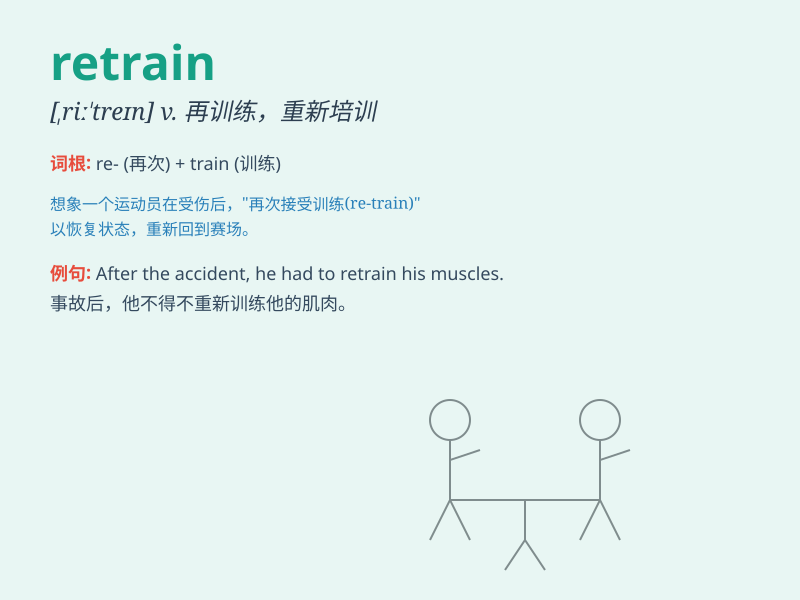

## retrain

**英音:** _[ˌriːˈtreɪn]_ **美音:** _[ˌriːˈtreɪn]_

**译义:** *vt.重新教育,再教育*

### 短语

+ **retrain workers:** _重新培训工人_

+ **retrain employees:** _重新训练员工_

+ **retrain the mind:** _重新训练思维_

+ **retrain for a new job:** _为新工作重新培训_

+ **retrain skills:** _重新训练技能_

### 例句

#### 例句1

> **The company decided to retrain its employees to improve their
skills.**

**中文翻译:** 公司决定重新培训其员工以提高他们的技能。

**单词释义:** 重新培训

#### 例句2

> **After the accident, the athlete had to retrain to regain his
form.**

**中文翻译:** 事故发生后，这位运动员不得不重新训练以恢复状态。

**单词释义:** 重新训练

#### 例句3

> **The software glitch required us to retrain the system.**

**中文翻译:** 软件故障要求我们重新培训这个系统。

**单词释义:** 重新培训

### 背诵小故事

> 想象一个运动员受伤后，状态不佳。教练决定让他重新接受训练，即
retrain。这个过程充满挑战，但他坚持不懈，最终恢复了最佳水平。

**想象一位运动员受伤后被重新训练的情景来辅助记忆 retrain
这个单词，意思是重新训练**

### 图义

